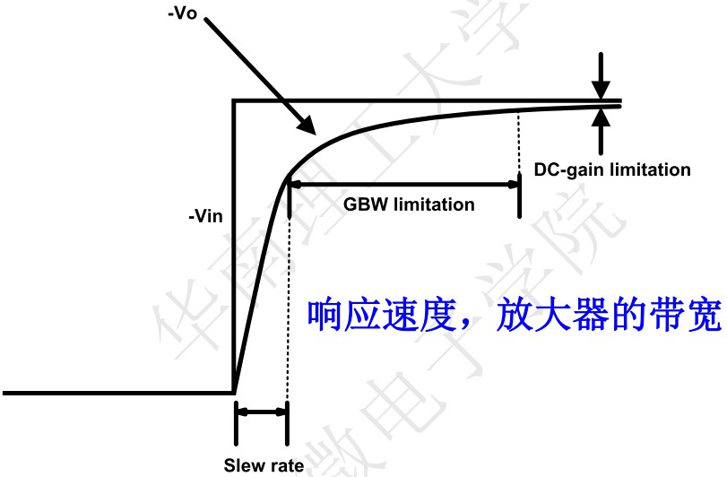

<!--more-->

$$
\begin{align*}
\newcommand{\dif}{\mathop{}\!\mathrm{d}}
\newcommand{\belowarrow}[1]{\mathop{#1}\limits_{\uparrow}}
\newcommand{\bd}{\boldsymbol}
\newcommand{\tx}{\text}
\newcommand{\p}{\partial\,}
\end{align*}
$$

## General Considerations

%20Basic%20negative-feedback%20system,%20and%20(b)%20phase%20shift%20around%20the%20loop%20at%20ω1.jpg)

考虑 Fig. 10.1 的传输函数，容易写出：

$$
[X(s)-\beta Y(s)]H(s)=Y(s)\\
\Rightarrow \frac{Y}{X}(s)=\frac{H(s)}{1+\beta H(s)}
$$

当分母为 0 时，传输函数趋向无穷，电路开始振荡，我们将这种情况称为 **Barkhausen’s Criteria**，此时的频率满足：

$$
\begin{aligned}
\vert \beta H(j\omega_1) \vert &= 1\\
\angle \beta H(j\omega_1)&=-180^\circ\\
\end{aligned}
$$

当然，这只是临界条件，实际上，只要 $\angle \beta H(j\omega_1)=-180^\circ$ 时，$\vert \beta H(j\omega_1) \vert \geq 1$ 就会发生震荡。比如在 Fig. 10.2a 中，在 $-180^\circ$ 处，增益大于 0 dB，所以不稳定。而 Fig. 10.2b 中，增益为 0 dB 时（即 gain crossover），相位大于 $-180^\circ$；或者在相位等于 $-180^\circ$ 时（即 phase crossover），增益小于 0 dB，所以稳定。

%20unstable%20and%20(b)%20stable%20systems.jpg)

我们将 gain crossover 处的频率记为 GX，此时相位离 $-180^\circ$ 的距离称为 **phase margin（PM）**。phase crossover 处的频率记为 PX，此时增益离 0 dB 的距离称为 **gain margin（GM）**。易知，要使系统稳定，至少要求 GX<PX，PM>0，GM>0

最后复习一下怎么画 Bode plots，我们主要用两点规则：

1. The slope of the magnitude plot changes by+20 dB/dec at every zero frequency and by−20 dB/dec at every pole frequency
2. For a pole (zero) frequency ofωm, the phase begins to fall (rise) at approximately $0.1ω_m$, experiences a change of $−45^◦ (+45^◦)$ at $ω_m$, and approaches a change of $−90^◦ (+90^◦)$ at approximately $10ω_m$

利用这两点规则我们可以大致算出 PM。

> [!TIP]
> Consider the stability of a feedback system incorporating a one-pole forward amplifier. Assuming $H(s)=A_0/(1+s/\omega_0)$

> [!NOTE]
> $$
H(s)=\frac{A_0}{1+\dfrac{s}{\omega_0}}\\
\Rightarrow \frac{Y}{X}(s) = \frac{\dfrac{A_0}{1+\beta A_0}}{1+\dfrac{s}{\omega_0(1+\beta A_0)}}
$$ 

we plot $|\beta H|$ and $\angle \beta H$ in Fig. 10.5, observing that a single pole cannot contribute a phase shift greater than $90^\circ$ and the system is unconditionally stable for all nonnegative values of $β$ 

 

## Phase Margin

系统要稳定，PM 要大于 0，但要大多少呢？前面说过，当 GX 与 PX 重合时（$\rm PM=0$），输出会出现振荡，频率响应出现无穷大的点；

而当 PX 稍大于 GX 时（$\rm PM>0$），输出会出现衰减的振荡，频率响应出现过冲（Fig. 10.10a）；

当 PX 远大于 GX 时（$\rm PM \geq 0$），基本上没有振荡，也没有过冲（Fig. 10.10b）。

%20small%20and%20(b)%20large%20margin%20between%20gain%20and%20phase%20crossover%20points.jpg)

图中的过冲对应的就是振荡的幅度，我们可以利用如下方法近似计算过冲：$\beta H = \vert \beta H\vert \exp(\angle \beta H)$，在 GX 处，$\vert \beta H\vert=1$，而 $\angle \beta H=-180^\circ+\text{PM}$，因此我们可以算出该点的 $\beta H$，把 $\beta H$ 代入 $\frac{Y}{X}$ 的表达式中，就能得到过冲。

那么多大的 PM 合适呢？我们先考虑最简单的情况：两个极点，并且 $\omega_{p2}= \text{unity-gain bandwidth}$ (Fig. 10.11)，那么 $\text{PM}=45^\circ$，利用上述方法，有：

$$
\begin{aligned}
    \vert \frac{Y}{X}(\omega_2) \vert &= \frac{H}{1+\beta H}\\
    &=\frac{1}{\beta} \frac{\beta H}{1+\beta H}\\
    &=\frac{1}{\beta} \frac{\exp(-j135^\circ)}{1+\exp(-j135^\circ)}\\
    &=\frac{1.306}{\beta}
\end{aligned}
$$

改变 PM，我们可以得到不同的过冲。当 $\text{PM}=60^\circ$ 时，$Y/X=1/\beta$，是最理想的情况（实际上此时依然会有少量过冲，一般取 $70^\circ$）。当 $\text{PM}=90^\circ$ 时，$Y/X=0.707/\beta$，此时完全无过冲，但阶跃响应的速度反而没有 $60^\circ$ 时快（Fig. 10.13）。

[!NOTE]
补充一下，在单极点系统中，unity-gain bandwidth 和 GBW（带宽增益积）是同一个东西，都是指 GX 对应的频率。并且这个值越大，响应速度越快。 

最后我们介绍一下已知 $A_0,\omega_1,\omega_2$，如何计算 PM。

* 计算 GBW：
  * 先计算 $\omega_2$ 处的增益：$A(\omega_2) = 20\lg(A_0)-20(\lg\omega_2-\lg\omega_1)$
  * 再求解 GBW 的方程：$40\lg(\text{GBW}/\omega_2)=A(\omega_2)$
  * 或者像我一样，直接一条公式搞定：$\text{GBW} = \sqrt{A_0\omega_1 \omega_2}$
* 代入如下公式：
  
  $$
  \begin{aligned}
      \text{PM} &= 180^\circ - \arctan(\tx{GBW}/\omega_1)-\arctan(\tx{GBW}/\omega_2)\\
      &=90^\circ - \arctan(\tx{GBW}/\omega_2) \quad {\rm if\; \tx{GBW} \gg \omega_1}
  \end{aligned}
  $$

我们一般希望 $\omega_2=3 \tx{GBW}$，就是想要 $\tx{PM}\approx 70^\circ$

[!NOTE]
对上述公式的简单推导：我们知道传递函数 $\angle H = \angle Y-\angle X$（Y 是分子，X 是分母），并且已知有如下三角公式： 

$$
\arctan A + \arctan B = \arctan \frac{A+B}{1-AB}\\
\angle A = \arctan \frac{\tx{img}(A)}{\text{real}(A)}
$$ 
> 
> 于是我们只需要证明在 $\omega = \tx{GBW}$ 处，开环增益形如： 
> 
> $$
\frac{k}{(1-AB)+j(A+B)}\\
A=\frac{\text{GBW}}{\omega_1},\; B= \frac{\text{GBW}}{\omega_2}
$$

假设二阶系统的开环增益为 $A_O = \dfrac{A_{v0}}{(1+j\omega/\omega_1)(1+j\omega/\omega_2)}$，那么： 

$$
\begin{aligned}
    \beta A_O &= \frac{\beta A_O}{(1+j\omega/\omega_1)(1+j\omega/\omega_2)}\\
    &=\frac{\beta A_O}{(1-\dfrac{\omega^2}{\omega_1\omega_2})+j(\dfrac{\omega}{\omega_1}+\dfrac{\omega}{\omega_2})}
\end{aligned}
$$ 
> 
> 把 $\omega = \tx{GBW}$ 代入后，符合前面说的形式，得证。 
> 
> 当然，感性上不需这么复杂，看图 Fig. 10.5 可以发现相位在 $\omega_1$ 处很像 $\arctan$ 函数，然后为了满足 $\arctan \omega_1 = -45^\circ$，我们就用 $\arctan(\omega/\omega_1)$ 来拟合计算。（$\omega_2$ 也是类似的）

## Basic Freq Compensation

## Compensation of Two-Stage Op Amps

要增大 Phase Margin，我们希望 **主极点靠近原点，非主极点远离原点**，这样的目的是使增益在 $-180^\circ$ 之前尽可能下降得多。这称为 **极点分离** 。有两种方法实现这一点。

### Miller Compensation

我们考虑下图中的两级 OPA，$C_c$ 为 Miller Capacitor，$R_{n1}$ 是第一级的输出阻抗。我们可以画出等效的小信号模型，注意到这个模型和频率响应一节中的 CS Stage 是一样的，故直接写出频率响应

$$
A_v = A_{v0} \frac{1-\dfrac{C_c}{g_{m2}}s}{1+(R_{n1}C_{n1}+A_{v2}R_{n1}C_c+R_LC_L)s+R_{n1}R_L CC s^2}\\
\tx{where}\\
A_{v0} = -A_{v1}A_{v2}=-g_{m1}g_{m2}R_{n1}R_L\\
CC = C_{n1}C_c+C_{n1}C_L+C_cC_L
$$

下面我们来分析 $C_c$ 对极点的影响。首先为了求解零点，我们将上式化简为：

$$
A = A_0 \frac{1-cs}{1+as+bs^2}
$$

这么一来就能写出零、极点（假设两个极点离得比较远）：

$$
s_z = \frac{1}{c}\\
主极点\; s_{p1} = -\frac{1}{a}\\
非主极点\; s_{p1} = -\frac{a}{b}
$$

注意到当 $a$ 增大时，主极点会减小，非主极点会变大，那么我们可以通过增大 $C_c$ 来增大 $a$

* 当 $C_c$ 较小时，$a$ 可看作与 $C_c$ 无关
* 当 $C_c$ 较大时，$a=A_{v2}R_{n1}C_c$
  * 此时的主极点为 $f_d = \dfrac{1}{2\pi A_{v2}R_{n1}C_c}$，显然 $C_c$ 越大，$f_d$ 越小
  * 非主极点为 $f_{nd}=\dfrac{A_{v2}R_{n1}C_c}{2\pi R_{n1}R_L CC}$
    * 如果 $C_c$ 不够大，那么 $CC\approx C_{n1}C_L$，显然 $C_c$ 越大，$f_{nd}$ 越大
    * 如果 $C_c$ 很大，那么 $CC\approx C_c(C_{n1}+C_L)$，此时 $f_{nd}$ 与 $C_c$ 无关。

综合以上分析，我们可以得到下面这幅图：

注意到图中还有一条绿色的线，那是零点，其表达式为 $f_z = \dfrac{g_m}{2\pi C_c}$，如果 $C_c$ 很大，那么零点就会靠近原点，并且由于这是个正零点，所以会使得相位 $-90^\circ$（见下图），这是我们不希望的。所以 **$C_c$ 不能太大**。当然，我们后面也会讲处理零点的方法。

#### Choice of Cc

$C_c$ 不能太小，也不能太大。前面说了，$f_{nd}$ 一般是 $3 \tx{GBW}$（对应 70° 的相位裕度），所以我们可以利用这个求出 $C_c$

先求 $\tx{GBW}$，为了简化分析，我们先忽略 $C_{n1}$，得到下图。图中，易知 $V_\tx{out} \cdot j\omega C_c =-g_{m1} V_\tx{in} $，故  $A_v = -g_{m1} \dfrac{1}{j\omega C_c}$，当 $\omega = \dfrac{g_{m1}}{C_c}$ 时，$\vert A_v \vert =1$，所以 $\tx{GBW} = \dfrac{g_{m1}}{2\pi C_c}$

下面再求 $f_{nd}$

$$
\begin{aligned}
  f_{nd}&=\frac{A_{v2}R_{n1}C_c}{2\pi R_{n1}R_L CC}\\
  &=\frac{g_{m2}C_c}{2\pi (C_{n1}C_c+C_{n1}C_L+C_cC_L)}\\
  &\approx \frac{g_{m2}}{2\pi C_L} \frac{1}{1+\dfrac{C_{n1}}{C_c}}
\end{aligned}
$$

代入 $f_{nd}=3 \tx{GBW}$，得到：

$$
\frac{g_{m2}}{g_{m1}} = 3 \frac{C_L}{C_c} \left(1+\dfrac{C_{n1}}{C_c}\right)
$$

由于我们一般取 $\dfrac{C_{n1}}{C_c}=0.3$ （我也不知道为什么……），最终我们得到：

$$
\frac{g_{m2}}{g_{m1}} = 4 \frac{C_L}{C_c}\\
\Rightarrow g_{m2} C_c = 4 g_{m1} C_L
$$

在设计时，一般给定了 $\tx{GBW}$ 和 $C_L$，我们可以按如下步骤求 $g_m$、$C_c$：

1. 根据 $f_{nd}=3 \tx{GBW}=\dfrac{g_{m2}}{2\pi C_L\cdot 1.3}$，求出 $g_{m2}$
2. 根据 $\dfrac{g_{m2}}{g_{m1}} = 4 \dfrac{C_L}{C_c}$，求出 $C_c$
3. 根据 $\tx{GBW}=\dfrac{g_{m1}}{2 \pi C_c}$，求出 $g_{m1}$

### Increase gm2

注意到在极点的表达式中：$f_d = \dfrac{1}{2\pi A_{v2}R_{n1}C_c}$ 与 $f_{nd}=\dfrac{A_{v2}R_{n1}C_c}{R_{n1}R_L CC}$ 都有 $A_{v2}$，那么我们可以通过增大 $A_{v2}$ 来让极点分离。

这种方法与 Miller Compensation 的区别是，非主极点会一直随着 $A_{v2}$ 一起增大，并且 $f_z$ 也会随 $A_{v2}$ 增大而远离原点，这再好不过了！

但这种方法也有缺点：the current consumption increases drastically