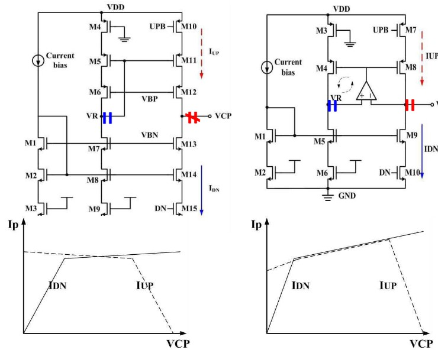

<!--more-->

$$
\begin{align*}
\newcommand{\dif}{\mathop{}\!\mathrm{d}}
\newcommand{\belowarrow}[1]{\mathop{#1}\limits_{\uparrow}}
\newcommand{\bd}{\boldsymbol}
\newcommand{\tx}{\text}
\newcommand{\L}{\mathscr{L}}
\newcommand{\p}{\partial\,}
\end{align*}
$$

## Intro of PLL

### Phase Detector

A phase detector is a circuit whose average output, $V_\tx{out}$ , is linearly proportional to the phase difference, $\Delta \phi$, between its two inputs (Fig. 16.1) The splope of the line is called the "gain" of the PD, $K_{PD}$

An example of a phase detecor is XOR gate(Fig. 16.2). However, the $\overline{V_\tx{out}} - \Delta \phi$ of XOR PD is not linear. (Fig. 16.3) （注意此处说的是平均输出电压）

补充，上面这个鉴相器的捕获范围（可正常工作的范围）是 $(0,\pi)$

### Basic PLL Topology

锁相环的目标是使得输出的频率与输入的参考频率相同。你可能会有疑惑：为什么不直接用参考频率呢？emm……锁相环的用途没这么简单，它有三个主要用途：

* 频率综合：产生 K 倍于参考频率的信号
* 减小时钟偏移：数字系统中常用
* 时钟恢复：在一些信号传输系统中会用到

既然是让频率一致，那为什么不叫“锁频环”而叫锁相环呢？这就要从 PLL 的原理来解释。

假设 VCO 的相位 $\phi_\tx{out}$与标准时钟的相位 $\phi_\tx{in}$ 相差 $\Delta \phi$，我们知道相位是频率的积分 $\phi = \int \omega_\tx{out} \dif t = \int (\omega_0 + K_\tx{VCO}V_\tx{cont}) \dif t$，假设输出与输入频率相差 $\phi_\tx{out} - \phi_\tx{in} = \Delta \phi$，那么对相位微分就得到频率：

$$
\omega_\tx{out} = \omega_\tx{in}+ \frac{\dif \Delta \phi}{\dif t}\\
$$

若我们能保持相位差恒定不变，即 $\dfrac{\dif \Delta \phi}{\dif t}=0$，那么 $\omega_\tx{out} = \omega_\tx{in}$。简单来说，就是通过相位锁定来实现频率锁定。

这么一来，我们可以画出一个简单的锁相环（Fig. 16.5a）为了滤除高频分量（避免抖动），我们在 PD 后面加一个低通滤波器（Fig. 18.5b）

%20Feedback%20loop%20comparing%20input%20and%20output%20phases;%20(b)%20simple%20PLL.jpg)
当锁相环锁定时（$V_\tx{in}$ 和 $V_\tx{out}$ 频率相同，但有相位差），其波形如 Fig. 16.7a 所示（the PD produces pulses only on the rising transitions）。

%20Waveforms%20in%20a%20PLL%20in%20locked%20condition;%20(b)%20calculation%20of%20phase%20error.jpg)
Fig. 16.7b 为 VCO 和 PD 的输出特性，用公式表示为：

$$
\begin{aligned}
    \omega_\tx{out} &= \omega_0 + K_{VCO}V_\tx{cont}\\
    \overline{V_{PD}} &= K_{PD} \Delta \phi
\end{aligned}
$$

若此时的振荡频率为 $\omega_1$，那么，我们求出 $V_1$ 和 $\phi_0$ 的值：

$$
V_\tx{cont,dc} = V_1 = \frac{\omega_1-\omega_0}{K_{VCO}}\\
\begin{aligned}
    \phi_0 &= \frac{V_1}{K_{PD}}\\
    &= \frac{\omega_1-\omega_0}{K_{PD}K_{VCO}}
\end{aligned}
$$

从上面计算中，我们可以得出两个结论：

1. 对于任意一个输入频率 $\omega_1$，都有唯一一个 $\phi_0$ 与之对应
2. 要想减少 $\phi_0$，就要增大 $K_{PD}K_{VCO}$

> [!TIP]
> 若 VCO 和 PD 的特性如下图所示，问能否锁定？ 
> 
> [!NOTE]
> 当输入频率小于 $\omega_X$ 时，可以锁定，但当输入频率达到 $\omega_X$ 时，若要锁定，则必须有 $V_\tx{cont}=V_0$，但此时 $\dfrac{\dif \overline{V_\tx{out}}}{\dif \Delta \phi}=0$，说明此时 PD 的输出无法响应相位的变化，就会导致无法锁定。 
> 
> 尝试用数学语言描述如下： 
> 
> $$
\omega_\tx{out} = \omega_0 + K_{VCO} f(\Delta \phi)\\
\Downarrow\\
\begin{aligned}
    \frac{\dif \omega_\tx{out}}{\dif t} &= \frac{\dif \omega_0}{\dif t} + K_{VCO} \frac{\dif f(\Delta \phi)}{\dif t}\\
    &=K_{VCO}\cdot \frac{\dif f(\Delta \phi)}{\dif \Delta \phi}\Bigg\vert_{v = V_0} \cdot \frac{\dif \Delta \phi}{ \dif t}\\
    &=0
\end{aligned}\\
$$ 
> 
> The PD gain drops to zero at $V_0$, thus $V_\tx{out}$ is time irrelevant and the feedback loop fails.

上面主要讨论的是锁定时的情况，下面来讨论一下 PLL 是怎么从未锁定到锁定的。

首先是相位突变（Fig. 16.11）。假设 $V_\tx{in}$ 在 $t=t_1$ 时刻突变了 $\phi_1$，这导致 PD 会输出一个 wider pulse，从而使 $V_{LPF}$ 的输出逐渐增大，导致 VCO 频率变大，加快输出电压的相位积累速度，从而减小相位差，最后锁定。在这个过程中，输出的额外的相位变化为：$\int_{t1}^\infty \omega_\tx{out} \dif t = \phi_1$，恰好弥补了输入的相位变化。

另一种是频率突变（Fig. 16.12）。假设输入频率在 $t=t_1$ 时变为 $\omega_1+\Delta \omega$，此时输出频率还是 $\omega_1$，就会导致 the PD generates increasingly wider pulses，从而增大 $V_{LPF}$，进而增大输出频率。当 $\omega_\tx{out}=\omega_1+\Delta \omega$ 时，就和相位突破的情况是一样的。最终锁定。

当然，上面讨论的都是理想情况，实际上，在反馈的过程中，可能会出现振荡，这就是我们后面要讨论的问题。

### Dynamics of Simple PLL

下面我们来讨论一下 PLL 的动态特性。我们先分析相位的传递函数 $\dfrac{\Phi_\tx{out}(s)}{\Phi_\tx{in}(s)}$.

* 对于 PD，它将相位差转换为电压，故它的传递函数为 $V = K_{PD} (\phi_\tx{out} - \phi_\tx{in})$
* LPD 的传输函数可以设为 $\dfrac{1}{1+s/\omega_{LPF}}$
* VCO 将电压转化为频率，又因为频率是相位的微分，所以传输函数为 $\dfrac{K_\tx{VCO}}{s}$

最终得到下图所示的系统：

$$
\begin{aligned}
    H(s)|_\tx{open} &= \frac{\Phi_\tx{out}}{\Phi_\tx{out}}(s)\\
    &= K_PD \cdot \frac{1}{1+\dfrac{s}{\omega_{LPF}}}\cdot \frac{K_{VCO}}{s}
\end{aligned}
$$

开环传输函数中有两个极点 $s_1=-\omega_{LPF}$，$s_2=0$ ，由于在原点处只有一个极点，所以称为 **type Ⅰ** PLL（Ⅰ型PLL）

$$
H(s)|_\tx{close} = \frac{K_{PD}K_{VCO}}{\dfrac{s^2}{\omega_{LPF}}+s+K_{PD}K_{VCO}}
$$

闭环传输函数如上所示。<!-- 由于 $\omega = \dif \phi / \dif t$，即 $\Omega = \Phi / s$，这么一来，$\frac{\Omega_\tx{out}}{}$ -->

注意到这是个二阶传输函数，我们可以写成标准形式：

$$
H(s) = \frac{\omega_n^2}{s^2+2\zeta \omega_n s+\omega_n^2}\\
\tx{damping factor } \omega_n = \sqrt{\omega_{LPF} K_{PD} K_{VCO}}\\
\tx{natural frequency } \zeta = \frac{1}{2} \sqrt{\frac{\omega_{LPF}}{K_{PD}K_{VCO}}}\\
\begin{aligned}
    \tx{poles } s_{1,2} &= -\zeta \omega_n \pm \sqrt{(\zeta^2-1)\omega_n^2}\\
    &= (-\zeta \pm \sqrt{\zeta^2-1})\omega_n
\end{aligned}
$$

* $\zeta\gt 1$，poles are real, 过阻尼
* $\zeta = 1$, 临界阻尼
* $\zeta \lt 1$, he poles are complex, 欠阻尼

在欠阻尼的情况下输入一个阶跃信号，输出会有衰减的振荡，其衰减的幅度取决于极点的实数部分 $\zeta \omega_n$。这个值越大，系统越快稳定。而根据 $\zeta,\omega_n$ 各自的表达式，我们可以求出：

$$
\zeta \omega_n =\frac{1}{2}\omega_{LPF}
$$

这个式子说明，速度与纹波之间有矛盾，$\omega_{LPF}$ 越大，速度越快，但高频分量的抑制越差，纹波越大。

## Charge-Pump PLLs

一型 PLL 有个缺点没提，就是它的捕获范围太小了，原书中说“其捕获范围与 $\omega_{LPF}$ 正相关”，也就说，当 $\omega_\tx{in}$ 与 $\omega_\tx{out}$ 的差距小于 $\omega_{LPF}$ 时才能锁定。

为了克服这种困难，我们引入“鉴频鉴相器”（Phase/Frequency Detector）

### Phase/Frequency Detector

简单来说，PFD 可以同时输出相位差与频率差。

%20Implementation%20of%20PFD;%20(b)%20implementation%20of%20D%20flipflop.jpg)
我们可以大致分析一下 DFF 实现的原理。

1. 当 A 的上升沿先到时，QA = 1；而当 B 的上升沿到时，QB = 1，经过与门后会将 QA 重置为 0
2. 反之，若 B 先到，则 QB 会输出一段时间的脉冲

好吧，其实我个人觉得这根本没有鉴频，只是单纯输出一个正的相位差和负的相位差而已。

易知 PFD 的捕获范围是 $(-2\pi, 2\pi)$，当等于 $2\pi$ 时，两个信号重新重叠，输出 $\overline{V_\tx{out}}=0$

### Charge Pump

我们可以用电流泵将 PFD 的两个输出转化为单一电压。CP 中有两个电流源， UP current 负责给 Cp 充电，DOWN current 负责给 Cp 放电。充放电受 QA、QB 控制。

### Basic Charge-Pump PLL

下面我们来考虑一个由 CP+VCO 组成的 PLL

首先我们需要写出 CP 的传输函数。定义充电电流为 $\pm I_P$，假设相位差为 $2\pi$，那么输出电压为 $\dfrac{I_P}{C_P}t\cdot u(t)$，如果相位差为 $\Delta \phi$，那么输出电压为 $\dfrac{\Delta \phi}{2\pi} \dfrac{I_P}{C_P}t\cdot u(t)$，于是传输函数是：

$$
\frac{V_\tx{out}}{\Delta \phi}(s) = \frac{I_P}{2\pi C_P}\cdot \frac{1}{s}
$$

> 注：$s$ 是由 $C_P$ 引入的

那么我们就可以画出系统框图：

开环传输函数为：

$$
H(s)|_\tx{open} = \frac{\Phi_\tx{out}}{\Phi_\tx{out}}(s) = \frac{I_P}{2\pi C_P} \frac{K_{VCO}}{s^2}
$$

由于开环传输函数在原点处存在两个极点，所以该系统称为 type Ⅱ PLL（二型 PLL）

闭环传输函数为：

$$
H(s)|_\tx{close} = \frac{\dfrac{I_P K_{VCO}}{2\pi C_P}}{s^2+\dfrac{I_P K_{VCO}}{2\pi C_P}}
$$

注意到这个传输函数有一正一负两个极点，所以该系统是不稳定的！为了使该系统稳定，我们可以加入一个零点，即加入一个电阻 $R_P$：

加入电阻后，PFD 的传输函数就变为：

$$
\frac{V_\tx{out}}{\Delta \phi}(s) = \frac{I_P}{2\pi }\cdot (R_P+\frac{1}{C_P s})
$$

开环传输函数：

$$
H(s)|_\tx{open} = \frac{\Phi_\tx{out}}{\Phi_\tx{out}}(s) = \frac{I_P}{2\pi}(R_P + \frac{1}{C_P s}) \frac{K_{VCO}}{s}
$$

闭环传输函数：

$$
H(s)|_\tx{close} = \frac{\dfrac{I_P K_{VCO}}{2\pi C_P}(R_P C_P s+1)}{s^2+\dfrac{I_P}{2\pi} K_{VCO} R_P s+\dfrac{I_P}{2\pi C_P} K_{VCO}}
$$

见图 Fig. 16.34，这个零点会使得开环传输函数的相位抬升 90°，从而在 GX 处相位裕度大于 0.

%20Loop%20gain%20characteristics%20of%20simple%20charge-pump%20PLL;%20(b)%20addition%20of%20zero.jpg)

二型 PLL 的 damping factor 与 natural frequency 如下：

$$
\omega_n = \sqrt{\dfrac{I_P K_{VCO}}{2\pi C_P}}\\
\zeta = \frac{R_P}{2}\sqrt{\dfrac{I_P C_P K_{VCO}}{2\pi}}
$$

$$
\zeta \omega_n = \frac{R_P I_P K_{VCO}}{4 \pi}
$$

## Nonideal Effects in PLLs

### PFD/CP Nonidealities

**Dead Zone（死区）** If the input phase difference $\Delta \phi$ is too small, the pulses on $Q_A$ or $Q_B$ may not have enough time to reach a logical high level and fail to turn on the charge pump switches. We refer this region of $\Delta \phi$ “dead zone” ($\pm \phi_0$ in Fig. 16.41)

The dead zone will cause jitter as it allow the VCO to accumulate as much random phase error as $\phi_0$.

有趣的是，这个 Nonideal effect 被另一个 Nonideal effect 解决了。由于 $Q_A,Q_B$ activate the reset 也需要一定时间，这就会导致即使在 zero phase 时，PFD 会输出一个很小的 pulse $T_P$（Fig. 16.39），若这个 $T_P$ 刚好打开 CP，就能消除死区（Fig. 16.43）

**Delay Difference Between $Q_A$ and $Q_B$** 简而言之就是 由于 $Q_A$ 经过了一个反相，会滞后于 $Q_B$，解决方法就是在 $Q_B$ 上加一个传输门（Fig. 16.44）

%20Implementation%20of%20charge%20pump;%20(b)%20effect%20of%20skew%20between%20QA%20and%20QB;%20(c)%20suppression%20of%20skew%20by%20a%20pass%20gate.jpg)

**The Mismatch Between The Drain Currents of $M_1$ and $M_2$（充、放电电流失配）**，这会导致 $V_\tx{cont}$ 在 $\Delta phi=0$ 时不能保持恒定（Fig. 16.45a）。在存在某个特殊的相位差时，Net Current=0，此时 $V_\tx{cont}$ 才能恒定（但实际还是有波纹）。

充、放电电流失配的原因主要是沟道长度调制效应，因此可以利用“反馈”来调整 gate 的电压，从而使电流相同。

**Charge-Sharing Phenomenon** 由于 MOS 存在电容，所以在开关打开时，电荷会在电容之间平分，导致 Vcont 电压下降（Fig. 16.46），解决方法很简单，添加 bootstrapping 来给电容预充电。

