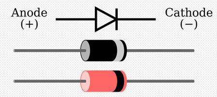

<!--more-->

$$
\begin{align*}
\newcommand{\dif}{\mathop{}\!\mathrm{d}}
\newcommand{\belowarrow}[1]{\mathop{#1}\limits_{\uparrow}}
\newcommand{\bd}{\boldsymbol}
\newcommand{\tx}{\text}
\newcommand{\L}{\mathscr{L}}
\newcommand{\p}{\partial\,}
\end{align*}
$$

## 概念

PDK, Process Design Kits
EDA, Electronic Design Automatic

## 器件

### Diode

<!-- 

 -->

<!-- 

 -->

### MOSFET

#### MOSFET Structure

Use above n-type MOS as an example. It has:

* p-type **bulk** (**body**)
* heavily-doped n-type **source** and **drain**
* heavily-doped conductive polysilicon **gate**
* oxide

Some parameters:

* source-drain path length $L$ or $L_\tx{drawn}$
  * effective length $L_\tx{eff} - 2L_D$
* oxide thickness $t_\tx{ox}$

The comprehensive parameters of SPICE model are shown below:（我们后面会解释这些量怎么用）

|Level 1 SPICE models for NMOS and PMOS devices|
|-----------|
|NMOS Model |
|$$\begin{matrix}\rm &LEVEL=1 &VTO=0.7 &GAMMA=0.45 &PHI=0.9\\ &NSUB=9e+14 &LD=0.08e−6 &UO=350 &LAMBDA=0.1\\ &TOX=9e−9 &PB=0.9 &CJ=0.56e−3 &CJSW=0.35e−11\\ &MJ=0.45 &MJSW=0.2 &CGDO=0.4e−9 &JS=1.0e−8\end{matrix}$$|
|PMOS Model |
|$$\begin{matrix}\rm &LEVEL=1 &VTO=−0.8 &GAMMA=0.4 &PHI=0.8\\ &NSUB=5e+14 &LD=0.09e−6 &UO=100 &LAMBDA=0.2\\ &TOX=9e−9 &PB=0.9 &CJ=0.94e−3 &CJSW=0.32e−11 \\&MJ=0.5 &MJSW=0.3 &CGDO=0.3e−9 &JS=0.5e−8\end{matrix}$$|

* VTO: threshold voltage with zero VSB(unit: V)
* GAMMA: body-effect coefficient (unit: V1/2)
* PHI: 2 $\Phi_F$ (unit: V)
* TOX: gate-oxide thickness (unit: m)
* NSUB: substrate doping (unit: cm−3)
* LD: source/drain side diffusion (unit: m)
* UO: channel mobility (unit: cm2/V/s)
* LAMBDA: channel-length modulation coefficient (unit: V−1)
* CJ: source/drain bottom-plate junction capacitance per unit area (unit: F/m2)
* CJSW: source/drain sidewall junction capacitance per unit length (unit: F/m)
* PB: source/drain junction built-in potential (unit: V)
* MJ: exponent in CJ equation (unitless)
* MJSW: exponent in CJSW equation (unitless)
* CGDO: gate-drain overlap capacitance per unit width (unit: F/m)
* CGSO: gate-source overlap capacitance per unit width (unit: F/m)
* JS: source/drain leakage current per unit area (unit: A/m2)

> For more information about SPICE MOSFETS model, please visit [http://diyhpl.us/~nmz787/mems/unorganized/SPICE_MOSFET_Model_Intro.pdf](http://diyhpl.us/~nmz787/mems/unorganized/SPICE_MOSFET_Model_Intro.pdf)

The S/D junction diode must be reverse-biased, therefore p-substrate must have the most negative voltage:

For PMOS, the n-substrate must have the most positive voltage:

In CMOS technologies, NMOS and PMOS devices must be fabricated on the same wafer (usually p-type substrate), therefore PMOS device is fabricated in an n-well [Fig. 2.4(b)]. In most circuits, the n-well is tied to the most positive supply voltage.

> [!TIP]
> QUESTION: which connection is wrong? 
> 

> [!NOTE]
> Solution: The right one is wrong. We can draw the structure below: 
> 

 
> The two p+ bucks being connected through p-substrate causes short circuit, which neutralizes the left NMOS, While the two n+ bucks are separated by p-substrate. 
> There are two way to solve the problem. Connect the middle p+ buck directly to groud, or use deep n-well. 
> 

#### MOS characteristics

Consider an NFET shown in Fig 2.6(a), as $V_G$ becomes more positive, the holes in th p-substrate are repelled from the gate area, leaving the negative ions, creating a **depletion region**

As $V_G$ increases, When the interface potential reaches a sufficiently positive value, electrons flow from the source to the interface and eventually to the drain.

We define $V_\tx{TH}$ of an NFET as the gate voltage for which the interface is "as much n-type as the substrate is p-type". It can be proved that:

$$
V_\tx{TH}=\Phi_{MS}+2\Phi_F+\frac{Q_\tx{dep}}{C_\tx{ox}} \tag{2.1}
$$

where 

* $\Phi_{MS}$ is the difference between the work functions of the polysilicon gate and the silicon subatrate.
* $\Phi_F=(kT/q)\ln(N_\tx{sub}/n_i)$, $k$ is Boltzmann's constant, $N_\tx{sub}$ is the doping density of the substrate.
* $Q_\tx{dep}=\sqrt{4 q \epsilon_\tx{si} \vert \Phi_F \vert N_\tx{sub}} $ is the charge in the depletion region.
* $C_\tx{ox}$ is the gate-oxide capacitance per unit area.

We divided MOS by their $V_\tx{TH}$，i.e.

* nvt $V_\tx{TH}=0$，n stands for native
* lvt $V_\tx{TH}>0$, l stands for low
* hvt $V_\tx{TH}\gg 0$, h stands for high

We can adjust $V_\tx{TH}$ by implantation of dopants into the channel area during device fabrication.

PFET is similar to NFETs, but we need to apply a negative voltage to gate.

---

We know that a current $I$ can be expressed as:

$$
I=Q_d \cdot v \tag{2.2}\\
Q_d:\text{charge density}
$$

Consider an NFET whose source is connected to ground and drain is connected to $V_D$ (Fig. 2,10(b))The charge density along the channel can be derived from the definition of $C_\tx{ox}$:

$$
Q_d(x) = W C_\tx{ox} [V_{GS}-V(x)-V_\tx{TH}]
$$

From ${\rm (2.2)}$ the current is given by

$$
I_D = -W C_\tx{ox} [V_{GS}-V(x)-V_\tx{TH}] v
$$

Noting that $v=\mu E$ and $E(x)=-\dif V/\dif x$, we have

$$
I_D = W C_\tx{ox} [V_{GS}-V(x)-V_\tx{TH}] \mu_n \frac{\dif V(x)}{\dif x}
$$

subject to boundary conditions $V(0)=0$ and $V(L)=V_{DS}$。 Multiplying both sides by $\dif x$ and performing integration, we obtain

$$
\int_{x=0}^L I_D \dif x = \int_{V=0}^{V_{DS}} W C_\tx{ox} \mu_n [V_{GS}-V(x)-V_{TH}] \dif V \tag{2.7}
$$

Since $I_D$ is constant along the channel,

$$
I_D = \mu_n C_\tx{ox} \frac{W}{L}\left[(V_{GS}-V_\tx{TH})V_{DS}-\frac{1}{2} V_{DS}^2\right]
$$

Note that $L$ is the effective channel length.

This is a quadratic function, at $V_{DS}=(V_{GS}-V_\tx{TH})$, it reaches its maximum value:

$$
I_{D,\tx{max}} = \frac{1}{2}\mu_n C_\tx{ox} \frac{W}{L}(V_{GS}-V_\tx{TH})^2
$$

if $V_{DS}\ll 2(V_{GS}-V_\tx{TH})$, we have

$$
I_D \approx \mu_n C_\tx{ox} \frac{W}{L}(V_{GS}-V_\tx{TH})V_{DS}
$$

that is, the drain current is a linear function of $V_{DS}$, we call it 线性区

The linear realtionship implies that the path from the source to the drain can be represented by a linear resistor equal to

$$
R_\tx{on} = \frac{1}{\mu_n C_\tx{ox} \frac{W}{L}(V_{GS}-V_\tx{TH})} \tag{2.11}
$$

A MOSFET can therefore operate as a resistor whose value is controlled by the overdrive voltage (so long as $V_{DS}\ll 2(V_{GS}-V_\tx{TH})$ )

---

if $V_{DS}>V_{GS}-V_\tx{TH}$, $[V_{GS}-V(x)-V_\tx{TH}]$ drops to zero before $x=L$, i.e. the inversion layer stops at $x\leq L$. We say the he channel is "pinch off"(夹断)

The integral  must be taken from $x=0$ to $x=L'$, and $V(x)=0$ to $V(x)=V_{GS}-V_\tx{TH}$ as a result,

$$
I_D = \frac{1}{2} \mu_n C_\tx{ox} \frac{W}{L'}(V_{GS}-V_\tx{TH})^2 \tag{2.13}
$$

> 注：此处可暂时认为 $L'\approx L$，后面我们会在 Channal Length Modulation 中讨论 $L'$

indicating that $I_D$ is relatively independent of $V_{DS}$ and becomes constant, and we cay the device operates in the "saturation" region.

We call the minimum $V_{DS}$ necessary for operation in sturation **overdrive voltage**, for this reason, some books write $V_{D,\tx{sat}}=V_{GS}-V_\tx{TH}$

How does the device conduct current in the presence of pinch-off? As the electrons approach thepinch-off point (whereQd→0), their velocity rises tremendously (v=I/Qd). Upon passing the pinch-off point, the electrons simply shoot through the depletion region near the drain junction and arrive at thedrain terminal.

#### MOS Transconductance

Since a MOSFET operating in saturation produces a current in response to its gate-source overdrive voltage, we define the figure of merit as the change in the drain current divided by the change in the gate-sourcevoltage. Called the **transconductance** (and usually defined in the saturation region) and denoted by $g_m$

$$
g_m = \left.\frac{\p I_D}{\p V_{GS}}\right|_{V_{DS} \text{ const.}}\\
=\mu_n C_\tx{ox}\frac{W}{L}(V_{GS}-V_\tx{TH})
$$

$g_m$ represents the sensitivity of the device: for a high $g_m$, a small change in $V_G$ Sresults in a large change in $I_D$

if we apply $\text{2.13}$, $g_m$ can also be expressed as 

$$
\begin{cases}
  (V_{GS}-V_\tx{TH}) = \sqrt{\dfrac{2 I_D}{\mu_n C_\tx{ox} \frac{W}{L}}}\\
  \mu_n C_\tx{ox} \dfrac{W}{L'} = \dfrac{2I_D}{(V_{GS}-V_\tx{TH})^2} 
\end{cases}\\
\Rightarrow g_m = \begin{cases}
   \mu_n C_\tx{ox}\dfrac{W}{L}(V_{GS}-V_\tx{TH})\\
    \sqrt{2 \mu_n C_\tx{ox} \frac{W}{L} I_D}\\
  \dfrac{2I_D}{V_{GS}-V_\tx{TH}}
\end{cases}
$$

这三种公式我们要用哪一种呢？如果是在题目中，那么就根据题目给出的条件来求。如果是在后面推导其他公式，那么我们选择的公式中一要包含我们关心的量，二要包含我们要求不变的量。

#### Second-Order Effects

**Body Effect** 体效应 In the analysis above, we tacitly assumed that the bulk and the source were tied to ground. However the buck might drop below the source voltage, making more holes are attracted to the substrate connection, i.e. the depletion region becomes wider.

Recall from Eq. $(2.1)$, the threshold voltage is a function of the total charge in the total charge in the depletionregion because the gate charge must mirror $Q_d$ before an inversion layer is formed. Thus, **as $V_B$ drops and $Q_d$ increases, $V_\tx{TH}$ also increases**. With body effect,

$$
V_\tx{TH}=V_\tx{TH0}+\gamma(\sqrt{2\Phi_F+V_{SB}}-\sqrt{\vert 2 \Phi_F\vert})
$$

**Channel-Length Modulation** 沟道长度调制效应 The actual length of the channel $L'$ is a function of $V_{DS}$.

if we define $L'=L-\Delta L$, i.e., $1/L' \approx (1+\Delta L/L)L$, and assuming a first-order relationship $\Delta L/L=\lambda V_{DS}$, we have, in saturation,

$$
I_D \approx \frac{1}{2}\mu_n C_\tx{ox} \frac{W}{L}(V_{GS}-V_\tx{TH})^2(1+\lambda V_{DS})
$$

一般来说，沟道长度越长，沟道长度调制效应就越不明显，所以我们可以简单的认为：$\lambda \propto \dfrac{1}{L}$

**Subthreshold Conduction** 亚阈值导电 For $V_{GS} < V_\tx{TH}$, a "weak" inversion layer still exists, and $I_D$ exhibits an *exponential* dependence on $V_{GS}$

$$
I_D = I_0 \exp \frac{V_{GS}}{\xi V_T}
$$

定义能效比 $g_m/I_D$，单位 $I_D$ 提供的 $g_m$，我们有：

#### MOS Capacitances

1. the oxide capacitance $C_1 = WLC_\tx{ox}$
2. the depletion capacitance $C_2=WL\sqrt{q \epsilon_\tx{si}N_\tx{sub}/(4\Phi_F)}$
3. the overlap capacitance $C_3,C_4$
4. the junction capacitance

#### MOS Small-Signal Model

In many analog circuits, MOSFETs are biased in the saturation. If we appy a change to the gate-source voltage, $\Delta V=V_{GS}$，the drain current therefore changes by $g_m V_{GS}$. The model is in Fig. 2.37(a)

If we consider the channel-length modulation, the drain current also varies with the drain-source voltage, this is modelled by a voltage-dependent current (Fig. 2.37(a))

the voltage-dependent current whose value linearly depends on the voltage across it is equivalent to a linear resistor [Fig. 2.37(b)], the resistor is given by

$$
\begin{aligned}
  r_O &= \frac{\p V_{DS}}{\p I_D}\\
  &= \frac{1}{\p I_D/\p V_{DS}}\\
  &=\frac{1}{\frac{1}{2}\mu_n C_{ox}\frac{W}{L} (V_{GS}-V_\tx{TH})^2 \cdot \lambda}\\
  &\approx \frac{1+\lambda V_{DS}}{\lambda I_D}\\
  &\approx \frac{1}{\lambda I_D} \; \tx{assume }\lambda V_{DS}\ll 1
\end{aligned}
$$

The bulk potential influences the threshold voltage. Therefore the drain current is a function of the bulk volage. That is, the bulk behaves as a second gate. We can modeling this by a current source $g_mb V_{BS}$ between D and S [Fig. 2.37(d)]

$$
\begin{aligned}
  g_{mb} &= \frac{\p I_D}{\p V_{BS}}\\
  &= \mu_n C_\tx{ox} \frac{W}{L}(V_{GS}-V_\tx{TH})\left(-\frac{\p V_\tx{TH}}{\p V_{BS}}\right)\\
  &=g_m \frac{\gamma}{2\sqrt{2\Phi_F+V_{SB}}}\\
  &= \eta g_m
\end{aligned}
$$

> 这里完全没有区分直流大信号与交流小信号，比如图(d)中的 $V_{BS}$ 指交流小信号，但 $g_{mb}$ 公式中的 $V_{SB}$ 又是指直流大信号，这两者并非互为相反数！不得不说这很容易混淆😓。建议通过上下文来区分。
> 
> 另外，注意到图 (d) 中使用了 $V_{gs}$ 而不是 $V_{GS}$，或许将来可以用 $V_{gs}$ 来指代交流小信号？这就交给下几届的同学来讨论吧。

> [!TIP]
> 如何利用 SPICE 模型参数求出小信号模型？

|Level 1 SPICE models for NMOS and PMOS devices|
|-----------|
|NMOS Model |
|$$\begin{matrix}\rm &LEVEL=1 &VTO=0.7 &GAMMA=0.45 &PHI=0.9\\ &NSUB=9e+14 &LD=0.08e−6 &UO=350 &LAMBDA=0.1\\ &TOX=9e−9 &PB=0.9 &CJ=0.56e−3 &CJSW=0.35e−11\\ &MJ=0.45 &MJSW=0.2 &CGDO=0.4e−9 &JS=1.0e−8\end{matrix}$$|
|PMOS Model |
|$$\begin{matrix}\rm &LEVEL=1 &VTO=−0.8 &GAMMA=0.4 &PHI=0.8\\ &NSUB=5e+14 &LD=0.09e−6 &UO=100 &LAMBDA=0.2\\ &TOX=9e−9 &PB=0.9 &CJ=0.94e−3 &CJSW=0.32e−11 \\&MJ=0.5 &MJSW=0.3 &CGDO=0.3e−9 &JS=0.5e−8\end{matrix}$$|

> [!NOTE]
> <ol>
>     <li>
>       首先求 $\mu_n C_\tx{ox}$
>       <ul>
>         <li>
>           $\mu_n$ 对应 SPICE 中的 <strong>UO</strong>（注意单位！）
>         </li>
>         <li>
>           $C_\tx{ox} = \dfrac{\varepsilon_0 \varepsilon_{r,\tx{ox}}}{t_\tx{ox}}$，分子部分是常量，为 $8.8\times 10^{-14} \times 3.9 \tx{F/cm}$，分母对应 SPICE 中的 <strong>TOX</strong>
>         </li>
>       </ul>
>     </li>
>     <li>
>       然后求 $g_m$，我们可以从 SPICE 中知道 $V_\tx{TH}$（即 VTO），题目一般会给$W/L$，以及 $V_{GS}$ 或 $I_D$，这样就能用前面的第一条或第二条公式求。
>     </li>
>     <li>
>       $r_O=\dfrac{1}{\lambda I_D}$，$\lambda$ 对应 SPICE 中的 <strong>LAMBDA</strong>，$I_D$ 由题目给出或通过饱和区 $I_D$ 公式求（要考虑沟道长度调制效应）
>     </li>
>     <li>
>       $g_{mb}=g_m \dfrac{\gamma}{2\sqrt{2\Phi_F+V_{SB}}}$，$\gamma$ 对应 SPICE 中的 <strong>GAMMA</strong>，$2\Phi_F$ 对应 SPICE 中的 <strong>PHI</strong>，$V_{SB}$ 由题目给出
>     </li>
>     <li>
>       $C_{GD}=WC_\tx{ov}$，$C_\tx{ov}$ 即 SPICE 中的 <strong>CGDO</strong>
>     </li>
>     <li>
>       $C_{GS}=\dfrac{2}{3}WLC_\tx{ox}+WC_\tx{ov}$，$C_\tx{ox}$ 之前求过，$C_\tx{ov}$ 即 SPICE 中的 <strong>CGSO</strong>（但课本中的表格并没有给出这个参数，所以只能用 CGDO 代替）
>     </li>
>     <li>$C_{GB}$ 一般忽略</li>
>     <li>$C_{DB},C_{SB}=WEC_j+2(W+E)C_{jsw}$</li>，$C_j$ 即 <strong>CJ</strong>，$C_{jsw}$ 即 <strong>CJSW</strong>，$E$ 是 D、S 的长度（但我从来没见题目给过）
>   </ol>

> [!CAUTION]
> 补充：如果涉及电容的计算，那么 $L$ 应该减去 $LD$ （source/drain side diffusion） 
> 根据上面过程计算出的值如下：
> <ul>
>   <li>
>   NMOS：$\mu_n C_\tx{ox} = 1.335\times 10^{-4} {\rm A/V^2}$
>   </li>
>   <li>
>   PMOS：$\mu_p C_\tx{ox} = 3.813\times 10^{-5} {\rm A/V^2}$
>   </li>
> </ul>

### 电阻

CMOS 工艺中的电阻种类：

* 硅电阻(poly resistor)
* 扩散电阻(diffusion resistor)
* 金属电阻(造成 IR drop)
* MOS 导通电阻（$R_\tx{on}$）

电阻参数：

* 方块电阻(sheet resistance 单位 $\Omega$/$\square$)
* 通孔电阻(contact resistance 单位)
* 温度系数

### 电容

* MOS 电容：4-20 ${\rm nF/mm^2}$（绝缘栅很薄，单位密度高）
* MIM 电容（Metal-Insulator-Metal）：1-5 ${\rm nF/mm^2}$（精度高）
* MOM 电容（Metal-Oxide-Metal）：1-5 ${\rm nF/mm^2}$（充分利用面积）
* 高密度 MIM 电容：20-50 ${\rm nF/mm^2}$
* 深槽电筒（deep trench）：50-400 ${\rm nF/mm^2}$

该选用哪种电容？

1. 指定转角频率（cut-offfrequency）的RC滤波器MIM—高精度
2. 特定工作频率的振荡器
   * 高频——MIM（高精度，Q值高）
   * 低频——MOM（面积小）
3. 电源上的去耦电容MOS——低频、节省面积

## 习题

* MOS管的layout是怎样的？尝试画出来
* MOS管有哪几个工作区？每个工作区的特性和表达式？
  > 三个区，分别是：
  >
  > 1. 可变电阻区 triode region
  >    * $V_{GS}>V_\tx{TH}$ 且 $V_{GS}-V_{DS}>V_\tx{TH}$
  >    * NMOS：$I_D = \mu_n C_\tx{ox} \frac{W}{L}\left[(V_{GS}-V_\tx{TH})V_{DS}-\frac{1}{2} V_{DS}^2\right]$
  >    * PMOS：上面加负号
  > 2. 恒流区（饱和区）saturation region
  >    * $V_{GS}>V_\tx{TH}$ 且 $V_{GS}-V_{DS}< V_\tx{TH}$
  >    * NMOS：$I_D = \frac{1}{2} \mu_n C_\tx{ox} \frac{W}{L'}(V_{GS}-V_\tx{TH})^2$
  >    * PMOS：上面加负号
  > 3. 截止区（夹断区）cut-off region
  >    * $V_{GS}< V_\tx{TH}$
  >    * $I_D=0$
* MOS管的二级效应有哪些？各有什么影响？表达式是？
  > 1. 体效应（Body Effect）
  >    * $V_B \downarrow$ 导致更多空穴被吸引到 Buck，耗尽层宽度 $\uparrow$，$V_\tx{TH}\uparrow$
  >    * $V_\tx{TH}=V_\tx{TH0}+\gamma(\sqrt{2\Phi_F+V_{SB}}-\sqrt{\vert 2 \Phi_F\vert})$
  > 2. 沟道长度调制效应（Channel Length Modulation Effect）
  >    * 有效沟道长度与 $V_{DS}$ 有关
  >    * $I_D \approx \frac{1}{2}\mu_n C_\tx{ox} \frac{W}{L}(V_{GS}-V_\tx{TH})^2(1+\lambda V_{DS})$
  > 3. 亚阈值导电（Subthreshold Conduction）
  >    * $V_G< V_\tx{TH}$ 时，仍有弱反型层存在
  >    * $I_D = I_0 \exp \dfrac{V_{GS}}{\xi V_T}$
* MOS管小信号模型是什么？
  > 1. 定义：小信号模型是大信号模型在静态工作点附近的近似
  > 2. 公式：
  >    * $I_D=g_m V_{GS}$，其中 $g_m=\mu_n C_\tx{ox}\frac{W}{L}(V_{GS}-V_\tx{TH})$
  >    * 若考虑沟道调制效应，则 DS 两端等效为电流源 $I_D$ 与 $r_O$ 的并联，其中 $r_O=\dfrac{1}{\lambda I_D}$
  >    * 若考虑体效应，则在上一条的基础上并联上 $g_{mb}V_{BS}$，其中 $g_{mb}=\eta g_m$，$\eta=\dfrac{\gamma}{2\sqrt{2\Phi_F+V_{SB}}}$
  
* 请推导 $g_m$的三种表达式
  > $$
  > \because I_D = \frac{1}{2} \mu_n C_\tx{ox} \frac{W}{L'}(V_{GS}-V_\tx{TH})^2\\
  > \begin{aligned}
  > \therefore g_m &= \left.\frac{\p I_D}{\p V_{GS}}\right|_{V_{DS} \text{ const.}}\\
  > &=\mu_n C_\tx{ox}\frac{W}{L}(V_{GS}-V_\tx{TH})
  > \end{aligned}
  > $$
  >
  > $$
  > \because\begin{cases}
  > (V_{GS}-V_\tx{TH}) = \sqrt{\dfrac{2 I_D}{\mu_n C_\tx{ox} \frac{W}{L}}}\\
  > \mu_n C_\tx{ox} \dfrac{W}{L} = \dfrac{2I_D}{(V_{GS}-V_\tx{TH})^2} 
  > \end{cases}\\
  > \therefore g_m = \begin{cases}
  >  \sqrt{2 \mu_n C_\tx{ox} \frac{W}{L} I_D}\\
  > \dfrac{2I_D}{V_{GS}-V_\tx{TH}}
  > \end{cases}
  > $$

