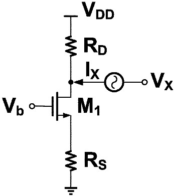
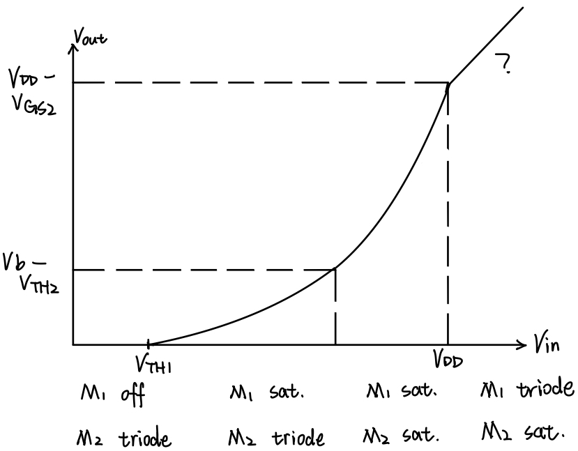
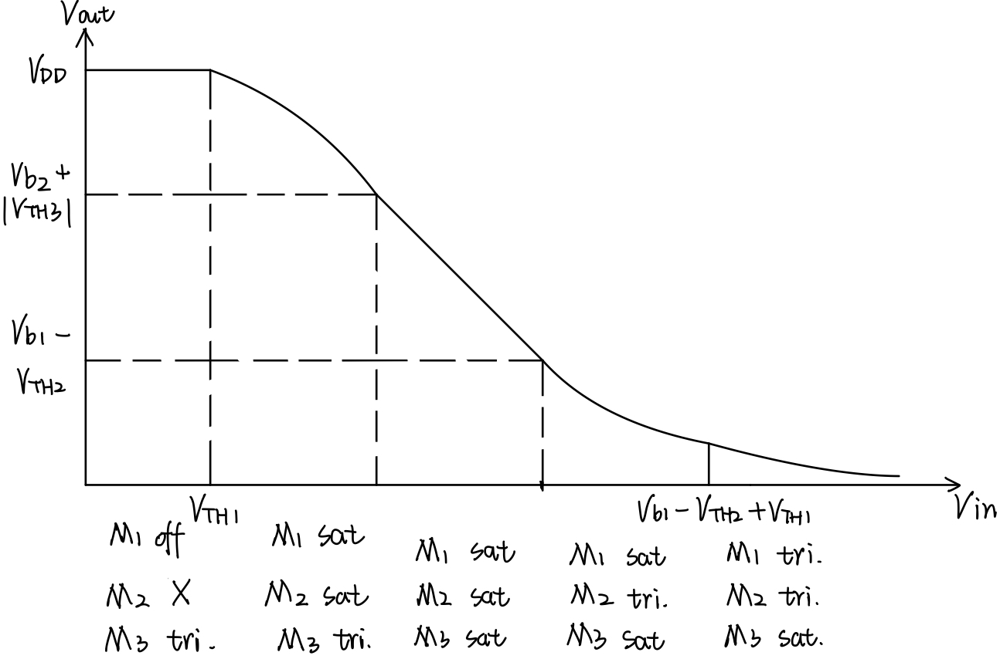
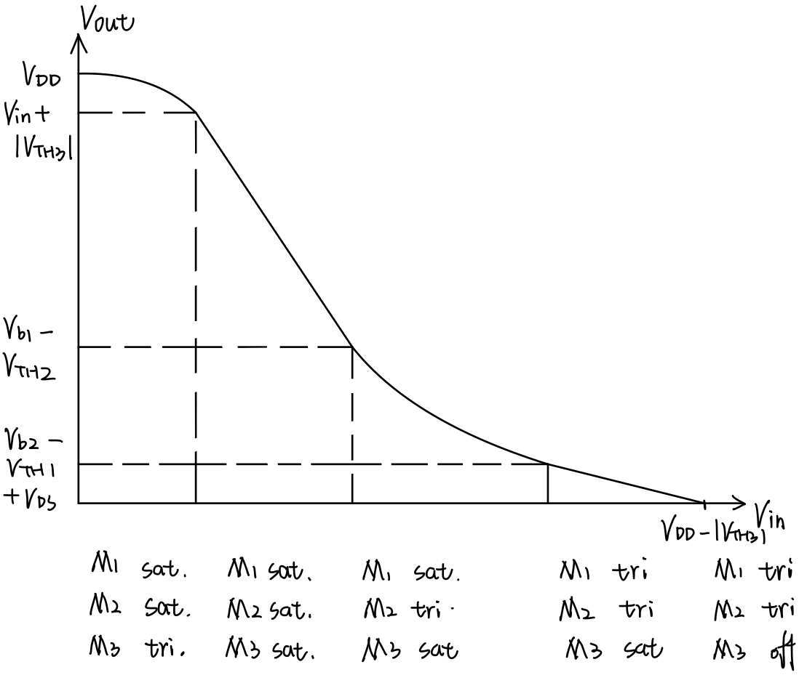

<!--more-->

$$
\begin{align*}
\newcommand{\dif}{\mathop{}\!\mathrm{d}}
\newcommand{\belowarrow}[1]{\mathop{#1}\limits_{\uparrow}}
\newcommand{\bd}{\boldsymbol}
\newcommand{\tx}{\text}
\newcommand{\L}{\mathscr{L}}
\newcommand{\p}{\partial\,}
\end{align*}
$$

关于模型的选择（是否要考虑 $r_O,g_{mb}$）：

* 在计算偏置时，不需要考虑二级效应（即  $r_O,g_{mb}$）
* 题目没有说，则默认要考虑二级效应，但如果题目太复杂，可以只考虑某些地方的二级效应，比如：
  1. 如果器件的漏极连接一个高阻抗（如另一个器件的源极），那么要考虑 $r_O$

关于公式的记忆：

* 只需要记考虑 $r_O,g_{mb}$ 的公式，其余公式可推出来
* 那个，共栅和其他几个公式不太一样，有人有好方法记吗？😫

> [!TIP]
> 求源极负反馈的输出阻抗：
> 
> [!NOTE]
> 根据小信号模型，我们有： 
> 
> $$
V_X = (I_X-g_mV_1-g_{mb}V_{bs})r_O+I_XR_S\\
\tx{where } V_1=V_{bs}=-I_XR_S\\
\Rightarrow V_X=[I_X+(g_m+g_{mb})R_SI_X]r_O+I_XR_S
$$ 
> 
> 可以算出： 
> 
> $$
\begin{aligned}
  R_\tx{out} &= \frac{V_X}{I_X}\\
  &= [1+(g_m+g_{mb})R_S]r_O+R_S\\
  &= [1+(g_m+g_{mb})r_O]R_S+r_O\\
  &= R_S+r_O+(g_m+g_{mb})r_OR_S
\end{aligned}
$$

> [!TIP]
> 求下图的输出阻抗：
> 
> 
> [!NOTE]
> 只需要将上面源极负反馈的输出阻抗并联上 $R_D$ 即可：$R_\tx{out}=\{[1+(g_m+g_{mb})R_S]r_O+R_S\} \Vert R_D$

> [!TIP]
> 3.2 In the circuit of Fig. 3.18, assume that $(W/L)_1=50/0.5$, $(W/L)_2=50/2$, and $I_{D1}=I_{D2}=0.5 \tx{mA}$ when both devices are in saturation. Recall that $λ∝1/L$. 
> (a) Calculate the small-signal voltage gain. 
> (b) Calculate the maximum output voltage swing while both devices are saturated. 
> 
> [!NOTE]
> Solution: 
> 
> (a) $A_v = -g_{m1}(r_{O1}\Vert r_{O2})$ where $g_m=\sqrt{2 \mu_n C_\tx{ox} \frac{W}{L} I_D}$ and $r_{O}\approx \dfrac{1}{\lambda I_D}$, therefore 
> 
> $$
\begin{aligned}
    g_{m1}&=\sqrt{2\times 1.34225\times 10^{-4} \times \frac{3.9}{9\times 10^{-9}}\times 50/0.5 \times  0.5 \times10^{-3}}\\
    &=3.664\times 10^{-3}\\
    r_{O1}&=\frac{1}{0.1\times 0.5 \times 10^{-3}}=20 {\rm k\Omega}\\
    r_{O2}&=\frac{1}{0.2\times 0.5 \times 10^{-3}}=10 {\rm k\Omega}\\
    A_v &= 3.664 \times 10^{-3} \times \frac{20 \times 10^3\times 10\times 10^3}{20 \times 10^3+ 10\times 10^3}\\
    &=24.43
\end{aligned}
$$ 
> 
> (b) $M_1,M_2$ are in saturation, therefore 
> 
> $$
V_\tx{in}-V_\tx{out}\leq V_\tx{TH1}\\
V_\tx{b}-V_\tx{out}\geq V_\tx{TH2}\\
\Rightarrow V_\tx{in}-V_\tx{TH1}\leq V_\tx{out}\leq V_\tx{b}-V_\tx{TH2}
$$ 
> 
> Assuming that $M_1$ is on the edge of the triode region, we have 
> 
> $$
\begin{aligned}
    I_D &= \frac{1}{2} \mu_n C_\tx{ox} (\frac{W}{L})_1(V_\tx{in}-V_\tx{TH1})^2(1+\lambda_n V_\tx{out})\\
    &\leq \frac{1}{2} \mu_n C_\tx{ox} (\frac{W}{L})_1 V_\tx{out}^2(1+\lambda_n V_\tx{out})
\end{aligned}\\
$$ 
> 
> Solve
> 
> $$
0.5\times 10^{-3}=\frac{1}{2}\times 1.34225 \times 10^{-4}\times 50/0.5\times V_\tx{out}^2(1+0.1 V_\tx{out})\\
$$
> 
> and we have 
> 
> $$
V_\tx{out,min}=0.2693 \tx{ V}
$$ 
> 
> 
> Assuming that $M_2$ is on the edge of the triode region, we have 
> 
> $$
\begin{aligned}
    I_D &= \frac{1}{2} \mu_p C_\tx{ox} (\frac{W}{L})_1(V_{SG2}-\vert V_\tx{TH2} \vert)^2(1+\lambda_n V_{SD2})\\
    &\leq\frac{1}{2} \mu_p C_\tx{ox} (\frac{W}{L})_1 V_{SD2}^2(1+\lambda_n V_{SD2})
\end{aligned}
$$ 
> 
> Solve
> 
> $$
0.5\times 10^{-3}=\frac{1}{2}\times 1.3835 \times 10^{-4}\times 50/2\times V_\tx{out}^2(1+0.2 V_\tx{out})\\
$$
> 
> and we have 
> 
> $$
V_\tx{SD,min}=0.9967 \tx{ V}\\
V_\tx{out,max}=V_{DD}-V_\tx{SD,min}=2.003 \tx{ V}
$$

> [!TIP]
> 3.17 Sketch $V_\tx{out}$ versus $V
> _\tx{in}$ for the circuits of Fig. 3.80 as $V_\tx{in}$ varies from 0 to $V_\tx{DD}$. Identify important transition points. 
> 
> 
> [!NOTE]
> (a) 
> 

 
> (b) 
> 

 
> (c) 
> 

 
> (d)（第二条式子多了个平方） 
> .PNG)
> [!CAUTION]
> &emsp;&emsp;我利用 Cadence 对 (c)(d) 电路进行了仿真，仿真结果如下（注意粉色的曲线是电流⚡）
> 
> > 
> &emsp;&emsp;对(c)(d)电路的详细分析：我们设 (c) 中输出为 $V_X$，(d) 中输出为 $V_Y$ 
> 
> &emsp;&emsp;不妨先考虑三个管子均饱和的情况。此时，若减小 $V_\tx{in}$，根据 $I_{D3}=\frac{1}{2}K_p(W/L) (V_{GS3}-V_\tx{TH3})^2$，$I_D$ 会变大，此时考虑 $M_1$，由于 $V_{GS1}$ 是固定的，所以如果不考虑沟道长度调制效应，$I_{D1}$ 不会变，这就产生了矛盾。故根据 $I_{D1}=\frac{1}{2}K_n(W/L) (V_{GS1}-V_\tx{TH1})^2(1+\lambda V_{DS1})$，$V_{DS1}$ 应该变大，即 $V_Y$ 应该变大，并且 $V_Y$ 与 $V_\tx{in}$ 之间应该为 2 次关系（开口向上）。$M_2$ 的情况与 $M_1$ 类似，但由于 $V_Y$ 上升导致 $V_{GS2}$ 变小，所以要使 $I_{D2}$ 同等变大，那么 $V_{DS2}$ 增大的幅度也应该更大（对应图中两线分离的部分）。 
> 
> &emsp;&emsp;然后考虑左边的情况，随着 $V_\tx{in}$ 减小且 $V_X$ 增大，$M_3$ 会进入 Triode，这么一来，$I_{D3}=K_p (W/L)[(V_{GS3}-V_\tx{TH})V_{DS3}-\frac{1}{2}V_{DS3}^2]$，注意到 $V_{GS3}$ 变大的同时 $V_X$ 会变大（$V_{DS3}$ 变小），这两者的作用会相互抵消，导致 $I_{D3}$ 几乎不变，从而 $V_{DS2},V_{DS1}$ 也几乎不变（对应图中下面的曲线平的那一段） 
> 
> &emsp;&emsp;（关于上一段的进一步解释。首先，既然 $I_D$ 不变，那么 $M_1,M_2$ 三端的电压也应该不变，否则电流就会变，但我们注意到图像中 $V_X$ 却会变大，这显然是矛盾的，唯一的解释就是此时不需要管 $M_2$ 的沟道长度调制效应了。另一个矛盾点是，我们易知：$\dfrac{\p I_{D3}}{\p V_{GS3}}=V_{DS}$，但图像中 $I_{D3}$ 并不随 $V_{GS3}$ 变化，所以这应该是 0，但显然 $V_{DS}\neq 0$😱，这点我实在解释不了……） 
> 
> &emsp;&emsp;

> [!CAUTION]
> 如何分析？ 
> <ol>
>   <li>先分析输入管的初始状态（要么是 Triode 要么是 Off），并分析此时有无 $I_D$</li>
>   <li>然后根据 $I_D$ 相同，来得到其他管的状态</li>
>   <li>然后改变输入</li>
>   <li>由于各管的状态不会突变（Off到Sat到Tri，或反过来），故可以给</li>
> </ol>

 

> [!TIP]
> 3.21 Assuming all MOSFETs are in saturation, calculate the small-signal voltage gain of each circuit in Fig. 3.84($λ \neq 0,γ=0$). 
> 
> [!NOTE]
> 因为题目说 $\lambda=0,\gamma=0$，也就是忽略所有的体效应和沟道长度调制效应，所以 $g_{mb}=0,r_O=\infty$，所以有些题目是无解的。答案上没有忽略 $r_{O}$，那我就当 $\gamma\neq 0$ 来做。

> [!NOTE]
> (a)  %20solution.PNG)
> [!NOTE]
> (b)  .PNG)
> [!NOTE]
> (c)  .PNG)
> [!NOTE]
> (d) $M_1,M_3$ 可看作 $r_{O1},r_{O3}$，根据前面的公式： 
> 
> $$
\begin{aligned}
  A_v &=-G_m(R_\tx{out}\Vert R_D)\\
  &= - \frac{g_mr_O}{R_S+r_O+g_mR_Sr_O}\cdot \frac{1}{\frac{1}{R_D}+\frac{1}{[R_S+r_O+g_mR_Sr_O]}}
\end{aligned}
$$ 
> 令 $R_S=r_{O1}$，$r_O=r_{O2}$，$R_D=r_{O3}$ 可得： 
> 
> $$
\begin{aligned}
  A_v&=-\frac{g_{m2}r_{O2}}{r_{O1}+r_{O2}+g_{m2}r_{O2}r_{O1}}\cdot \frac{1}{\frac{1}{r_{O3}}+\frac{1}{[r_{O1}+r_{O2}+g_{m2}r_{O2}r_{O1}]}}\\
  &=\frac{g_{m2}r_{O2}r_{O3}}{r_{O1}+r_{O2}+r_{O3}+g_{m2}r_{O2}r_{O1}}
\end{aligned}
$$

> [!NOTE]
> (e)  
> $$
\begin{aligned}
  R_\tx{out} &= \frac{r_{O3}+r_{O2}}{1+g_m r_{O2}}\\
    A_v &= \frac{V_\tx{out}}{V_\tx{in}}=\frac{r_{O1}}{r_{O1}+\frac{r_{O3}+r_{O2}}{1+g_{m2}r_{O2}}}
\end{aligned}
$$

> [!NOTE]
> (f)  
> .PNG)

(g)  .jpeg)

> [!NOTE]
> (h) 
> 在输入支路上，有： 
> $$
-(\frac{V_X}{r_{O3}}+g_{m3}V_\tx{out})=g_{m1}V_\tx{in}+\frac{V_X}{r_{O1}}
$$ 
> 在输出支路上，有： 
> $$
-\frac{V_\tx{out}}{r_{O2}}+g_{m2}(V_X-V_\tx{out})=0\\
\Rightarrow V_X=\frac{\frac{1}{r_{O2}}+g_{m2}}{g_{m2}}V_\tx{out}
$$ 
> 将 $V_X$ 代入输入支路表达式，有： 
> $$
-(\frac{1}{r_{O3}}\frac{\frac{1}{r_{O2}}+g_{m2}}{g_{m2}}V_\tx{out}+g_{m3}V_\tx{out})=g_{m1}V_\tx{in}+\frac{1}{r_{O1}}\frac{\frac{1}{r_{O2}}+g_{m2}}{g_{m2}}V_\tx{out}\\
$$ 
> 解得： 
> $$
A_v = \frac{V_\tx{out}}{V_\tx{in}}=-\frac{g_{m1}}{g_{m3}+(\frac{1}{r_{O3}}+\frac{1}{r_{O1}})\frac{\frac{1}{r_{O2}}+g_{m2}}{g_{m2}}}
$$