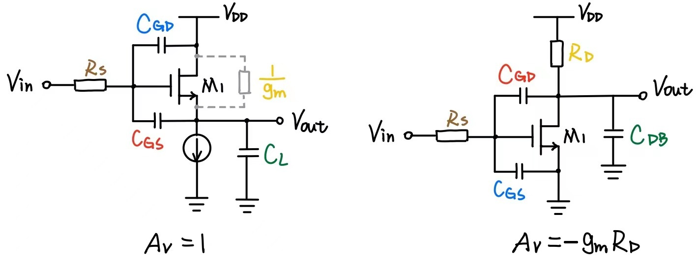

<!--more-->

$$
\begin{align*}
\newcommand{\dif}{\mathop{}\!\mathrm{d}}
\newcommand{\belowarrow}[1]{\mathop{#1}\limits_{\uparrow}}
\newcommand{\bd}{\boldsymbol}
\newcommand{\tx}{\text}
\newcommand{\L}{\mathscr{L}}
\newcommand{\p}{\partial\,}
\end{align*}
$$

## General Considerations

MOS 器件中存在四个电容：$C_{GS},C_{GD},C_{DB},C_{SB}$，所以在高频时会变得很复杂。为了简化分析，需要利用 Miller's theorem 和传输函数（信号与系统的相关内容）。下面先来复习一下：

* $s=1/j\omega$
* 零点、极点就是传输函数分子、分母的根
* Bode图中，每经过一个极点，斜率会增加 $20 \tx{dB/decade}$，每经过一个零点，斜率会减小 $20 \tx{dB/decade}$

### Miller Effect

**Miller's Theorem**：Fig. 6.2 中 (a) 和 (b) 可以互换，其中，$Z_1=Z/(1-A_v)$，$Z_2=Z/(1-A_v^{-1})$，$A_v=V_Y/V_X$，证明如下：

$$
\frac{V_X-V_Y}{Z}=\frac{V_X}{Z_1}\\
\Rightarrow Z_1 = \frac{Z}{1-\frac{V_Y}{V_X}}\\
根据对称性，Z_2 的证明过程类似
$$

利用这个，可以将浮空阻抗转化为接地阻抗。

> [!TIP]
> 
> [!NOTE]
> $V_X=-A\cdot V_Y$，根据前面的公式，有： 
> 
> $$
Z_1 = \frac{1/(sC_F)}{1+A}=\frac{1}{(1+A)(sC_F)}\\
Z_2 = \frac{1/(sC_F)}{1+1/A}
$$

注意，如果阻抗 $Z$ 是 $X,Y$ 两点之间的唯一通路，那么 Miller's theorem 不成立。考虑下面这个分压电路：

注意到 $V_Y=\frac{R_2}{R_1+R_2} V_X$，根据前面的公式，我们可以算出 Fig. 6.5(b) 的情况。注意到此时 $V_X$ 的输入电阻是正确的，但输出的 $V_Y=0$ 是错的。（总之，就是 Miller's theorem 不能改变 $V_X,V_Y$）

### Association of Poles with Nodes

图 Fig. 6.10 的传输函数为：

$$
\frac{V_\tx{out}}{V_\tx{in}}(s)=\frac{A_1}{1+R_SC_\tx{in}s}\cdot\frac{A_2}{1+R_1C_{N}s}\cdot \frac{1}{1+R_SC_{P}s}
$$

注意到每个极点都对应电路结点上的 $RC$ 的乘积，即 $\omega_j = \tau_j^{-1}=\dfrac{1}{RC}$（正负号不重要，而且一般都是负的）. From this perspective, we may say that “each node in the circuit contributes one pole to the transfer function.”，也就是说，我们先算直流增益，再乘上极点即可。

如果有 float impedance，可以利用 miller's theorem 转化成两个 gounded impedance.

## Common-Source Stage

Fig. 6.13(a) 是考虑了电容和 $R_S$ 的共源电路，我们可以利用 Miller's Approximation 将 $C_{GD}$ 分解为 Fig. 6.13(b) 的形式（图中 $A_v = -g_m R_D$），从而，输入端的极点为：

$$
\omega_\tx{in} = \frac{1}{R_S[C_{GS}+(1+g_m R_D)C_{GD}]}
$$

> 小吐槽：$R_S$ 很容易误认为是源端电阻，用 $R_G$ 会不会好一点？

而输出端的极点为：

$$
\begin{aligned}
  \omega_\tx{out} &= \frac{1}{R_D[C_{DB}+(1-A_v^{-1})C_{GD}]}\\
  &\approx \frac{1}{R_D(C_{DB}+C_{GD})}
\end{aligned}
$$

> [!TIP]
> 书中提到了另一种计算 $\omega_\tx{out}$ 的方法。如果 $R_{S}$ 很大，我们可以将 $R_S$ 视为断路，并得到如下电路图：
> 
> 

 
> 
> 请证明： 
> 
> $$
Z_X = \frac{1}{C_\tx{eq}s} \Big\Vert \left( \frac{C_{GD}+C_{GS}}{C_{GD}} \cdot \frac{1}{g_{m1}} \right)\\
C_\tx{eq} = \frac{C_{GD}C_{GS}}{C_{GD}+C_{GS}}
$$

> [!NOTE]
> 假设在 $V_X$ 处的电压为 $U_X$，那么，$C_{GS}$ 处的电压为 $U_X \cdot \frac{C_{GD}}{C_{GD}+C_{GS}}$（类似于电阻并联求电流），从而 $I_D=g_{m1} \cdot U_X \frac{C_{GD}}{C_{GD}+C_{GS}}$，求出 DS 的等效电阻为： 
> 
> $$
\frac{U_X}{I_D} = \frac{C_{GD}+C_{GS}}{C_{GD}} \cdot \frac{1}{g_{m1}}
$$ 
> 
> 而 $C_\tx{eq}$ 实际上就是 $C_{GS}$ 与 $C_{GD}$ 的并联值。把 $C_\tx{eq}$ 和 $R_\tx{eq}$ 就得到了 $Z_X$ 
> 
> 我们还可以进一步写出对应的输出极点： 
> 
> $$
\omega_\tx{out} = \frac{1}{\left[ R_D \Big\Vert \left( \frac{C_{GD}+C_{GS}}{C_{GD}}\cdot \frac{1}{g_{m1}} \right) \right](C_\tx{eq}+C_{DB})}
$$

从而传输函数为：

$$
\frac{V_\tx{out}}{V_\tx{out}}(s) = \frac{-g_m R_D}{(1+\dfrac{s}{\omega_\tx{in}})(1+\dfrac{s}{\omega_\tx{out}})}
$$

但上面分析并不严谨，我们没有考虑零点，也没考虑增益随频率的变化。下面我们用小信号模型来分析：

写出 s 域的电流方程（输入、输出端）：

$$
\begin{aligned}
  \frac{V_X - V_\tx{in}}{R_S}+V_X C_{GS} s + (V_X-V_\tx{out}) C_{GD}s &= 0\\
  (V_\tx{out}-V_X)C_{GD}s + g_m V_X + V_\tx{out}(\frac{1}{R_D}+C_{DB}s)&=0
\end{aligned}
$$

从输出端方程可以得到 $V_X$：

$$
V_X=-\frac{V_\tx{out}\left( C_{GD}s+\dfrac{1}{R_D}+C_{DB}s \right)}{g_m-C_{GD}s}
$$

把这个代回输入端方程，可以解出：

$$
\frac{V_\tx{out}}{V_\tx{in}}(s) = \frac{(C_{GD}s-g_m)R_D}{R_S R_D \xi s^2+[R_S(1+g_mR_D)C_{GD}+R_SC_{GS}+R_D(C_{GD}+C_{DB})]s+1}\\
\xi = C_{GS}C_{GD}+C_{GS}C_{DB}+C_{GD}C_{DB}
$$

这么长串公式，看着都觉得害怕。不要怕！分母不就是二项式嘛，分子不就是一项式嘛！只不过系数复杂一点。

我们一点一点来讲。首先，为什么分母是二项式？按道理，有三个电容，应该是三项式，但由于 $C_{GS}$、$C_{GD}$、$C_{DB}$ 构成了一个电压回路，导致它们中只有两个是独立的，故这只是二阶电路。

二阶电路有 $\omega_{p1}$ 和 $\omega_{p2}$，为了简化分析，我们假设 $\vert \omega_{p1} \vert \ll \vert \omega_{p2} \vert$，其中 $\omega_{p1}$ 即主极点（没学过自控的同学自行补课），于是分母可以化简为：

$$
\begin{aligned}
  D &= \left( \frac{s}{\omega_{p1}} +1\right) \left( \frac{s}{\omega_{p2}}+1 \right)\\
  &= \frac{s^2}{\omega_{p1}\omega_{p2}}+\left( \frac{1}{\omega_{p1}}+\frac{1}{\omega_{p2}} \right)s + 1\\
  &\approx \frac{s}{\omega_{p1}\omega_{p2}}+\frac{1}{\omega_{p1}}s+1
\end{aligned}
$$

这么来，$\omega_{p1}^{-1}$ 不就是一次项的系数嘛：

$$
\omega_{p1} = \frac{1}{[R_S(1+g_mR_D)C_{GD}+R_SC_{GS}+R_D(C_{GD}+C_{DB})]}
$$

对比之前的 $\omega_\tx{in} = \dfrac{1}{R_S[C_{GS}+(1+g_m R_D)C_{GD}]}$，我们可以发现 $\omega_{p1}$ 多了一项 $R_D(C_{GD}+C_{DB})$

另外 $(\omega_{p1}\omega_{p2})^{-1}$ 就是二次项系数，所以可以求出：

$$
\begin{aligned}
  \omega_{p2} &= \frac{1}{\omega_{p1}} \cdot \frac{1}{R_S R_D \xi}\\
  &= \frac{R_S(1+g_mRD)C_{GD}+R_SC_{GS}+R_D(C_{GD}+C_{DB})}{R_S R_D (C_{GS}C_{GD}+C_{GS}C_{DB}+C_{GD}C_{DB})}
\end{aligned}
$$

我们再来考虑分子，可以看出，存在一个零点 $\omega_z = + \dfrac{g_m}{C_{GD}}$。我们可以对该零点做一个直观的解释。考虑图 Fig. 6.17，信号从 $C_{GD}$ 进入输出，与放大后的信号恰好抵消，导致输出为 0.

.png)
还记得模电时提过，晶体管放大倍数为 0 时的频率为截止频率，记为 $f_T$。根据上面分析，我们近似认为 $f_T \approx 2\pi \dfrac{g_m}{C_{GD}}$

---

下面我们来考虑输入阻抗。With Miller's aproximation, we have from Fig. 6.21(a)

$$
Z_\tx{in} = \frac{1}{[C_{GS}+(1+g_mR_D)C_{GD}]s}
$$

而在高频时，需要考虑输出端的影响。先不考虑 $C_{GS}$ 这路，$C_{GD}$ 和 $R_D \Vert (C_{DB}s)^{-1}$ 的电阻为（Fig. 6.21）：

$$
(I_X-g_m V_X) [R_D \Vert (C_{DB}s)^{-1}]+\frac{I_X}{C_{GD}s} = V_X\\
\Rightarrow \frac{V_X}{I_X} = \frac{1+R_D(C_{GD}+C_{DB})s}{C_{GD}s(1+g_m R_D+R_DC_{DB}s)}
$$

与 miller 近似的结果相比，分子多了 $R_D (C_{GD}+C_{DB}) s$，而分母多了 $R_D C_{GD} C_{DB} s^2$。我们可以这样记忆，分子就是之前输入极点多出来那一项。而分母就是多出来那几个量相乘。

最终的输入电阻就是 $C_{GS}$ 并联上这玩意。

---

书中并没有说输出电阻，但我们还是计算一下。方法也是类似的，我们先不考虑 $R_D \Vert (C_{DB}s)^{-1}$，那么：

$$
\left(I_X-\frac{1}{g_m} V_X \frac{\dfrac{1}{1/R_S+C_{GS}s}}{\dfrac{1}{1/R_S+C_{GS}s}+\dfrac{1}{C_{GD}s}} \right) \left( \dfrac{1}{1/R_S+C_{GS}s}+\dfrac{1}{C_{GD}s} \right) = V_X
$$

$$
\Rightarrow \frac{V_X}{I_X} = \frac{\dfrac{1}{1/R_S+C_{GS}s}+\dfrac{1}{C_{GD}s}}{\dfrac{1/g_m}{1/R_S+C_{GS}s}+1}\\
=\frac{1+R_S(C_{GS}+C_{GD})s}{C_{GD}s(1+\frac{1}{g_m}R_S+R_S C_{GS}s)}
$$

（怎么感觉和 $V_\tx{in}$ 很像，是巧合吗？）

从而：

$$
Z_\tx{out} = R_D \big\Vert \frac{1}{C_{DB}s} \big\Vert \frac{1+R_S(C_{GS}+C_{GD})s}{C_{GD}s(1+g_mR_S+R_S C_{GS}s)}
$$

## Source Follower

%20Source%20follower;%20(b)%20high-frequency%20equivalent%20circuit.jpg)
We sum the currents at the output node:

$$
V_1 C_{GS} s + g_m V_1 = V_\tx{out} C_L s\\
\Rightarrow V_1 = \frac{C_L s}{g_m + C_{GS}s}V_\tx{out}
$$

Also, the $V_\tx{in}$ equals to the sum of the voltage across $R_S$ to $V_1$ and $V_\tx{out}$

$$
V_\tx{in} = R_S [V_1C_{GS}s+(V_1+V_\tx{out})C_{GD}s]+V_1+V_\tx{out}
$$

Subsituting for $V_1$, we have

$$
\frac{V_\tx{ont}}{V_\tx{in}} (s) = \frac{g_m + C_{GS} s}{R_S(C_{GS}C_L+C_{GS}C_{GD}+C_{GD}C_L)s^2+(g_m R_SC_{GD}+C_L+C_{GS})s+g_m} \tag{6.51}
$$

注意到，the zero $(-\dfrac{g_m}{C_{GS}})$ is in the left half plane (and near the $f_T$)

为了简化分析，我们还是假设 $\vert\omega_{p1} \vert \ll \vert \omega_{p2}\vert$，这么一来，我们就有（分子中的 $g_m$ 来自于分母的常数项）：

$$
\begin{aligned}
  \omega_{p1} &\approx \frac{g_m}{g_m R_S C_{GD}+C_L+C_{GS}}\\
  &= \frac{1}{R_S C_{GD}+\dfrac{C_L+C_{GS}}{g_m}}
\end{aligned}
$$

If $R_S=0$, then $\omega_{p1}=g_m/(C_L+C_{GS})$，这符合 miller 近似的结果。

（然后书中就戛然而止了，没有讨论 $\omega_{p2}$，可能是太简单了吧😆）

注意到 Common Source 和 Source Follower 很相似，它们各个元件都是可以一一对应的（如下图），只不过增益不同 ，因此它们的频率响应表达式是一样的。

---

下面来考虑输入阻抗。下图中我们不考虑 $C_{GD}$（反正最后并联上去就行了），但我们考虑 $1/g_{mb}$（如果要考虑 $r_O$，则替换为 $(1/g_{mb})\Vert r_O$）

可以得到：

$$
V_X = \frac{I_X}{C_{GS}s}+\left( I_X + \frac{g_m I_X}{C_{GS} s} \right)\left( \frac{1}{g_{mb}} \Big\Vert \frac{1}{C_L s} \right)\\
\Rightarrow Z_\tx{in} = \frac{1}{C_{GS}s} + \left( 1+\frac{g_m}{C_{GS}s} \right) \frac{1}{g_{mb}+C_L s}
$$

我们可以利用 Miller 等效得到类似的结果，$A_v=\frac{g_m}{g_m+g_{mb}+C_Ls}$，则 $C_{GS}$ 的弥勒等效为：

$$
\begin{aligned}
  C_{eq}s &=C_{GS}s(1-A_v)\\
&=C_{GS}s \frac{g_{mb}+C_Ls}{g_m+g_{mb}+C_Ls}
\end{aligned}
$$

从而有：

$$
Z_\tx{in}=\frac{1}{C_{eq}s}+\left( \frac{1}{g_{mb}} \Big\Vert \frac{1}{C_L s} \right)
$$

我们算一些特殊情况：

* $g_{mb}=0$ and $C_L=0$，$Z_\tx{in}=\infty$
* low frequencies, i.e. $g_{mb} \gg \vert C_L s \vert$, $Z_\tx{in} \approx \dfrac{1}{C_{GS}s}(1+\dfrac{g_m}{g_{mb}})+\dfrac{1}{g_{mb}}$$=\dfrac{1}{A_v C_{GS}s}+\dfrac{1}{g_{mb}}$
* high frequencies, i.e. $g_{mb} \ll \vert C_L s \vert$, $Z_\tx{in}\approx \dfrac{1}{C_{GS}s}+\dfrac{1}{C_L s}+\dfrac{g_m}{C_{GS}C_Ls^2}$

注意，在高频时，输入阻抗表达式中的第三项是一个负阻，这可以拿来产生振荡（Chapter 15）

---

接着来考虑输出阻抗。类似地，我们忽略 $\frac{1}{g_{mb}}$ 和 $C_L$（反正最后并联上去即可），还忽略 $C_{GD}$（为了简化计算）

根据电压电流方程：

$$
V_1 C_{GS} s + g_m V_1 = -I_X\\
V_1 C_{GS} s R_S + V_1 = -V_X
$$

解出：

$$
\begin{aligned}
  Z_\tx{out} &= \frac{V_X}{I_X}\\
  &= \frac{R_S C_{GS} s+1}{C_{GS}s+g_m}
\end{aligned}
$$

我们先来看两个特殊情况：

* 低频，$Z_\tx{out} \approx 1/g_m$
* 高频，$Z_\tx{out}\approx R_S$（$C_{GS}$ 短路）

根据 $1/g_m$ 和 $R_S$ 的大小，存在两种情况：Fig. 6.28b 和 Fig. 6.28c. 一般情况下，source follwer 作为 buffer 的输出电阻比较小，所以 $1/g_m< R_S$，也就是 Fig. 6.28c 的情况比较普遍。

注意到 Fig. 6.28c 中，$\vert Z_\tx{out}\vert$ 随着频率变大而变大，说明它展现出电感的性质。我们可以计算出等效电感。我们利用 Fig. 6.29 的等效模型，有：

$$
高频：R_1 = R_S-\frac{1}{g_m}\\
低频：R_2 = \frac{1}{g_m}
$$

等效电感为：

$$
\frac{1}{Z_\tx{out}-\dfrac{1}{g_m}} = \frac{1}{R_S - \dfrac{1}{g_m}} + \frac{1}{\dfrac{C_{GS}s}{g_m}\left( R_S - \dfrac{1}{g_m} \right)}\\
\Rightarrow L = \dfrac{C_{GS}s}{g_m}\left( R_S - \dfrac{1}{g_m} \right) \tag{6.66}
$$

我们可以利用这个性质在电路中引入电感（如 Fig. 6.30）

## Common-Gate Stage

At node $X$, the pole frequency is:

$$
\omega_\tx{in} = \left[ (C_{GS}+C_{SB})\left( R_S \Big \Vert\frac{1}{g_m+g_{mb}} \right) \right]^{-1}
$$

At node $Y$, $C_D=C_{DG}+C_{DB}$, the pole frequency is:

$$
\omega_\tx{out} = [(C_{DG}+C_{DB})R_D]^{-1}
$$

从而传输函数为：

$$
\begin{aligned}
\frac{V_\tx{out}}{V_\tx{in}}(s) &= \frac{(g_m+g_{mb})R_D}{1+(g_m+g_{mb})R_S}\cdot \frac{1}{\left( 1+\dfrac{s}{\omega_\tx{in}} \right)\left( 1+\dfrac{s}{\omega_\tx{out}} \right)}\\
&= \frac{(g_m+g_{mb})R_D}{1+(g_m+g_{mb})R_S}\cdot \frac{1}{\left( 1+ \dfrac{C_Ss}{g_m+g_{mb}+R_S^{-1}} \right)(1+R_D C_D s)}
\end{aligned}
$$

前面那玩意是忽略 $r_O$ 的 $A_v=\dfrac{[1+(g_m+g_{mb})r_O]R_D}{r_O+[1+(g_m+g_{mb})r_O]R_S+R_D}$ 。另外，$C_S=C_{GS}+C_{SB}$，$C_DC_{DG}+C_{DB}$

An important property of this circuit is that it exhibits no Miller multiplication of capacitances, potentially achieving a wide band.

---

下面我们来简单算一下输入阻抗，我们直接将第三章的公式改造一下：

$$
Z_\tx{in} \approx \frac{Z_L}{(g_m+g_{mb})r_O}+\frac{1}{g_m+g_{mb}} \tag{6.69}\\
Z_L = R_D \Vert [1+(C_D s)]
$$

---

我们没有考虑到一点，就是偏置也有可能带来的电阻 $R_G$，为了简化分析，只考虑一个电容 $C_{GS}$，并且忽略 channel length modulation 和 body effect.

%20CG%20stage%20with%20resistance%20in%20series%20with%20gate,%20and%20(b)%20equivalent%20circuit.png)
由 VCL：

$$
V_\tx{in}+(C_{GS}sV_1+g_m V_1) R_S+V_1+C_{GS}sV_1 R_S=0
$$

其中，$g_m V_1=-V_\tx{out}/R_D$，所以

$$
\begin{aligned}
\frac{V_\tx{out}}{V_\tx{in}}(s) &= \frac{g_m R_D}{(R_G+R_S)C_{GS}s+1+g_m R_S}\\
&= \frac{g_mR_D}{1+g_m R_S} \frac{1}{1+\frac{(R_G+R_S)C_{GS}}{1+g_m R_S}s}
\end{aligned}
$$

从而极点为：

$$
\omega_p = \frac{1+g_m R_S}{(R_G+R_S)C_{GS}}
$$

对比一下之前的极点（$\omega_\tx{in} = \left[ (C_{GS}+C_{SB})\left( R_S \Big \Vert\dfrac{1}{g_m+g_{mb}} \right) \right]^{-1}$），我们发现 $R_G$ 只是简单地加到 $R_S$ 上。

## Cascode Stage

首先，利用 Miller Approx. 将 $C_{GD1}$ 转换到 $A$ 端，我们有：

$$
\omega_{p,A} = \frac{1}{R_S \left[ C_{GS1}+\left( 1+\dfrac{g_{m1}}{g_{m2}+g_{mb2}} \right)C_{GD1} \right]}
$$

而在 $X$ 端，有：

$$
\omega_{p,Y} = \frac{g_{m2}+g_{mb2}}{2C_{GD1}+C_{DB1}+C_{SB2}+C_{GS2}}
$$

式中的 $2$ 来自于 $(1+\dfrac{g_{m2}+g_{mb2}}{g_{m1}})$ （我们假设这两个管子相似）

而在 $Y$ 端，有：

$$
\omega_{p,Y} = \frac{1}{R_D(C_{DB2}+C_L+C_{GD2})}
$$
---

（然后书本就突然跳到了 “把 $R_D$换成电流源”，然后没任何推导，就得到下面的一些结论😓）

If a cascode structure is used as a current source, then the variation of its output impedance with frequency is of interest. Neglecting $C_{GD1}$ and $C_Y$ in Fig. 6.35(a), we have

$$
Z_\tx{out} = (1+g_{m2}r_{O2})Z_X+r_{O2}
$$

where $Z_X=r_{O1}\Vert (C_Xs)^{-1}$. Thus, $Z_\tx{out}$ contains a pole at $(r_{O1}C_X)^{−1}$ and falls at frequencies higher than this value.

## Differential Pair

### 简单讨论

%20Differential%20pair;%20(b)%20half-circuit%20equivalent;%20(c)%20equivalent%20circuit%20for%20common-mode%20inputs.jpg)
差分对的传输函数、极点和共源差不多。我们先来讨论一下共模增益，还记得在第四章，我们有：

$$
A_\tx{CM-DM} = -\frac{\Delta g_m R_D}{(g_{m1}+g_{m2})R_{SS}+1}
$$

我们做简单的替换：$R_D\rightarrow R_D\Vert \dfrac{1}{C_Ls}$，$R_{SS}\rightarrow r_{O3}\Vert \dfrac{1}{C_ps}$，从而：

$$
A_\tx{CM-DM} = -\frac{\Delta g_m \left(R_D\Vert \dfrac{1}{C_Ls}\right)}{(g_{m1}+g_{m2})\left(r_{O3}\Vert \dfrac{1}{C_ps}\right)+1} \tag{6.88}
$$

一般来说，这个值小于 $1$，但随着频率增大，它会趋向于 $1$，This result suggests that the common-mode rejection of the circuit degrades considerably at high frequencies.

我们用同样的方法（就是简单的替换）来计算共模抑制比：

$$
\tx{CMRR}\approx \frac{g_m}{\Delta g_m}(1+2g_m R_{SS})\\
\Downarrow\\
\begin{aligned}
  \tx{CMRR}&\approx \frac{g_m}{\Delta g_m}\left[ 1+2g_m \left( r_{O3}\Vert\frac{1}{C_p s} \right) \right]\\
  &= \frac{g_m}{\Delta g_m} \frac{r_{O3}C_p s+1+2g_mr_{O3}}{r_{O3}C_p s+1}
\end{aligned}
$$

以防你忘了，顺便说一下：$g_m=\frac{g_{m1}+g_{m2}}{2}$，$\Delta g_m=g_{m1}-g_{m2}$

我们可以画出 CMRR 的 bode 图：

### Differential Pair with Active Load

%20Simplified%20high-frequency%20model%20of%20differential%20pair%20with%20active%20current%20mirror;%20(b)%20circuit%20of(a)%20with%20a%20Thevenin%20equivalent.jpg)
输入信号一路通过 $M_3,M_4$ 到输出，另一路则通过 $M_2$ 到输出。我们先来讨论前者。

前者在 $E$ 处会有一个极点：$g_{m3}/C_E$，其中，$C_E$ 包含 $C_{GS3},C_{GS4},C_{DB3},C_{DB1}$ 以及 Miller effect of $C_{GD1},C_{GD4}$。这个极点称为 **mirror pole**

为了简化分析，我们利用 Thevenin equivalent 简化得到 Fig. 6.41c。其中，$V_X=g_{mN}r_{ON}V_\tx{in}$，$R_X=2r_{ON}$（这个就不详细解释了，已经在差分放大器一节讲过了），另外，我们还忽略了 $r_{OP}$，因为一般 $1/g_{mP}\ll r_{OP}$

我们先计算 $V_E$ 处的电压：

$$
\begin{aligned}
  V_E &= (V_\tx{out}-V_{X})\frac{\dfrac{1}{C_E s+ g_{mP}}}{\dfrac{1}{C_E s+g_{mP}}+R_X}\\
  &=\frac{V_\tx{out}-V_{X}}{1+R_X(C_E s+g_{mP})}
\end{aligned}
$$

从而 $M_4$ 的电流为 $g_{mP}V_E$，另外 $I_X=V_E(g_{mP}+C_Es)$。我们就可以利用 KCL 计算出增益：

<!-- $$
-g_{mP} V_E - I_X = V_\tx{out}(C_L s+r_{OP}^{-1})\\
(-2g_{mP}-C_Es)(V_\tx{out}-V_{X})=V_\tx{out}(C_L s+r_{OP}^{-1})[1+R_X(C_E s+g_{mP})]\\
(-2g_{mP}-C_Es)g_{mN}r_{ON}V_\tx{in}=V_\tx{out} \left\{ (C_L s+r_{OP}^{-1})[1+2r_{ON}(C_E s+g_{mP})]+(2g_{mP}+r_{OP}^{-1}) \right\}
$$ -->

$$
I_X = \frac{V_\tx{out}-V_X}{R_X+\dfrac{1}{C_E s+g_{mP}}}\\
-g_{mP}V_E-I_X = V_\tx{out}(C_Ls+r_{OP}^{-1})
$$

最终结果为：

$$
\frac{V_\tx{out}}{V_\tx{in}} = \frac{g_{mN}r_{ON}(2g_{mP}+C_Es)r_{OP}}{2r_{OP}r_{ON}C_EC_Ls^2+[(2r_{ON}+r_{OP})C_E+r_{OP}(1+2g_{mP}r_{ON})C_L]s+2g_{mP}(r_{ON}+r_{OP})+1}\\
课本中的公式缺了一个 +1
$$

$$
\vert A_v \vert =  g_{mN}(r_{ON}\Vert r_{OP}) \frac{2g_{mP}r_{OP}+1}{2(g_{mP}r_{OP}+1)}
$$

我们还是假设 $\omega_{p1}\ll\omega_{p2}$，这样我们就有：

$$
\omega_{p1}\approx \frac{1+2g_{mP}(r_{ON}+r_{OP})}{(2r_{ON}+r_{OP})C_E+r_{OP}(1+2g_{mP}r_{ON})C_L}
$$

Neglecting the first term in the denominator and assuming that $2g_{mP}r_{ON}\gg 1$, we have

$$
\omega_{p1}\approx \frac{1}{(r_{ON}\Vert r_{OP})C_L}
$$

这个就是在 $V_\tx{out}$ 处的极点。

另外我们可以计算出 $\omega_{p2}$

$$
\begin{aligned}
  \omega_{p2} &= \frac{2g_{mP}(r_{ON}+r_{OP})}{2r_{OP}r_{ON}C_EC_L} \big/ \omega_{p1}\\
  &\approx \frac{2g_{mP}(r_{ON}+r_{OP})}{2r_{OP}r_{ON}C_EC_L} \frac{r_{ON}r_{OP}C_L}{r_{ON}+r_{OP}}\\
  &= \frac{g_{mP}}{C_E}
\end{aligned}
$$

这个就是在 $E$ 点处的极点。

零点为

$$
\omega_{z} = \frac{2g_{mP}}{C_E}
$$

恰好是两倍的 $\omega_{p2}$，这个结果可以用下面的数学模型来论证。

> [!TIP]
> 我们对这个零点做一个简单的建模。前面提过信号通过两路到输出，其中 $M_1,M_2,M_4$ 一路的增益为：$A_0/[(1+s/\omega_{p1})(1+s/\omega_{p2})]$，另外 $M_1,M_2$ 一路为 $A_0/(1+s/\omega_{p1})$，将这两路相加，得到： 
> 
> $$
\begin{aligned}
  \frac{V_\tx{out}}{V_\tx{in}} &= \frac{A_0}{(1+s/\omega_{p1})(1+s/\omega_{p2})}+\frac{A_0}{(1+s/\omega_{p1})}\\
  &= \frac{A_0(2+s/\omega_{p2})}{(1+s/\omega_{p1})(1+s/\omega_{p2})}
\end{aligned}
$$ 
> 
> 注意到零点恰好是两倍的 $\omega_{p2}$

## Appendix

书本的最后介绍了几种很实用的定理，对理解、记忆之前的公式有很大帮助。

### Extra Element Theorem

附加元件定理（EET）：若原本的传输函数为 $H(s)$，在电路中 A、B 处加入一个元件 $Z_1$，则新的传输函数为：

$$
G(s) = H(s) \frac{1+\dfrac{Z_\tx{out,0}}{Z_1}}{1+\dfrac{Z_\tx{in,0}}{Z_1}}
$$

* $Z_\tx{out,0}$：在 AB 端加上电压电流，并在 $V_\tx{in}$ 加上电压使得 $V_\tx{out}=0$，此时 $Z_\tx{out,0}=V_1/I_1$
* $Z_\tx{in,0}$：将输入短路，此时 $Z_\tx{in,0}=V_1/I_1$

%20Circuit%20with%20extra%20parallel%20element,%20Z1,%20(b)%20Zout,0%20calculation,%20and%20(c)%20Zin,0%20calculation.jpg)
我们在此并不证明该定理，因为知道了证明过程也没什么用。在此我们给出一个示例，来展示这个定理是怎样简化计算的。

> [!TIP]
> Using the EET, find the transfer function of the circuit in Fig. 6.47(a) 
> 
> [!NOTE]
> 我们先来计算 $V_\tx{out,0}$（Fig. 6.46b）。考虑到输出为 0，可以看作接地（但不是真的接地），则 $V_1=V_{GS}$。而 $I_1=-g_m V_{GS}=-g_m V_1$，从而 $V_\tx{out,0}=-\frac{1}{g_m}$ 
> 再来考虑 $V_\tx{in,0}$（Fig. 6.46c）。我们容易列出如下 KVL 方程 
> 
> $$
V_A + V_1 + V_{R_D} = 0\\
g_m I_1 R_S -V_1+(I_1+I_1 R_Dg_m) R_S=0\\
\Downarrow\\
Z_\tx{in,0} = (1+g_m R_S) R_D+R_S=(1+g_m R_D)R_S+R_D
$$ 
> 
> 从而传输函数为： 
> 
> $$
G(s) = -g_m(R_D\Vert r_O) \frac{1-\dfrac{1}{g_m}C_F s}{1+[(1+g_m R_D)R_S+R_D]C_F s}
$$ 
> 
> 注意到这里正确地给出了零点。

### Zero-Value Time Constant Method

如果我们只想考虑零点，那么我们只需要考虑 EET 中的 $Z_\tx{in,0}$ 即可，那么公式就会变为：

$$
G(s)=H(s) \frac{1}{1+\dfrac{Z_\tx{in,0}}{Z_1}}
$$

注意到当 $Z_1$ 是一个电容时，会引入一个 $Z_\tx{in,0}C_1$ 的极点。利用这个，我们将极点的计算过程简化如下：

1. 计算当输入短路时，从 $C_1$ 看进去的电阻 $R_1$（Fig. 6.49）
2. 极点为 $1/(R_1C_1)$

%20General%20circuit%20containing%20one%20capacitor,%20and%20(b)%20resistance%20seen%20by%20C1.jpg)
但这还没完，对于多个电容，我们有：

$$
G(s)=H(s) \prod_i \frac{1}{1+R_iC_i}
$$

此时一次项的系数为 $\sum_i (R_iC_i)$。因此，我们可以按照如下步骤估算主极点：

1. 将 $C_i$ 之外的其他电容置零（开路）
2. 按照上面步骤计算 $R_i$
3. 主极点为 $1/(\sum_i R_i C_i)$

利用这个我们可以很方便地计算出共源级的主极点。来试试看吧！下面我们重新计算一下共源的主极点。

1. 计算 $C_{GS}$ 的电阻 $R_{GS}$：由于 $C_{GD}$ 被置零，所以 $R_{GS}=R_S$
2. 计算 $C_{GD}$ 的电阻 $R_{GD}$：根据 KVL

$$
V_X = -I_{GD} R_S\\
-I_{GD}R_S+V_{DG}=(I_{GD}-g_m V_X) R_D\\
\Downarrow\\
R_{GD}=\frac{V_{DG}}{I_{GD}}=(1+g_mR_S)R_D+R_S\\
=(1+g_m R_D)R_S+R_D\\
输入电阻的电流电压方向不一致。
$$

3. 计算 $C_{DB}$ 的电阻 $R_{DB}$：同理，由于 $C_{GD}$ 被置零，所以 $R_{DB}=R_D$

从而极点为：

$$
\omega_{-3\tx{dB}}^{-1}=R_S C_{GS}+[(1+g_m R_D)R_S+R_D]C_{GD}+R_DC_{DB}\\
=R_SC_{GS}+R_S(1+g_mR_D)C_{GS}+R_D(C_GD+C_{DB})
$$

这和我们之前费老大劲算的是一样的哦！